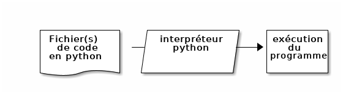
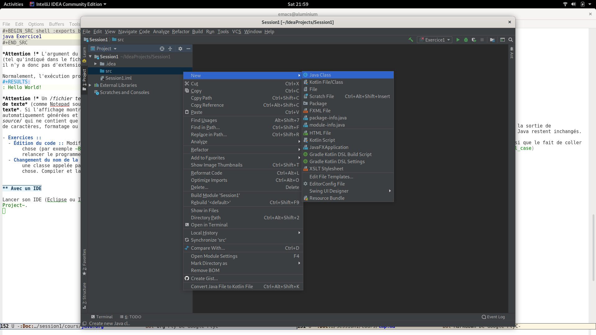

# Table des matières

1.  [Un arôme de Java](#orgbebd83c)
    1.  [Java, un langage compilé](#org786a852)
2.  [Premier programme Java](#orge703ff3)
    1.  [En mode "console"](#org296001b)
    2.  [Avec un IDE](#orga03c610)
    3.  [Un début d'explications](#org2c58b0a)
3.  [Conventions](#orgc630574)
4.  [Variables et typage](#orgea564c9)
    1.  [Variables locales](#orgdb6437c)
    2.  [Typage statique](#org6473c5d)
5.  [Types de données primitifs](#org2f1f866)
    1.  [Types numériques](#orgf31db64)
        1.  [Types entiers](#org063fcf2)
        2.  [Types à virgule](#org9cbf6a7)
    2.  [Type booléen](#org561a0f8)
    3.  [Type caractère](#org9974fab)
6.  [Types de données gérés par référence](#org0894b33)
    1.  [Types tableaux](#orgdda195d)
    2.  [Accès aux éléments d'un tableau](#org63a6cae)
    3.  [Accès à la taille du tableau](#org294185d)
    4.  [Tableau de tableaux](#orgdb80b44)
        1.  [Déclaration](#org7e54881)
        2.  [Initialisation partielle](#org8dfb851)
        3.  [Initialisation](#org3c6fbcc)
    5.  [Type chaîne de caractères](#org65540d3)
    6.  [Tous les autres types définissables (classes)](#org81d9817)
7.  [Structures de contrôle](#orgd1a9526)
    1.  [Exécution conditionnelle](#org85eca92)
        1.  [Expression booléennes](#org2f4f410)
        2.  [if](#org5214bfa)
        3.  [Opérateur ternaire](#orgaf9c17e)
    2.  [Boucles while(){} et do{} while();](#org7d65180)
    3.  [Boucles for(;;){} et for( : ){}](#orgc74c0e0)
        1.  [Boucle for classique](#orgf052fca)
        2.  [Boucle for sur une séquence de valeurs](#org3a752c5)
8.  [Fonctions](#orgb898f75)
    1.  [Instruction `return`](#orgb919e48)
    2.  [Passage d'argument](#orgdcdb891)
    3.  [Contexte local d'exécution / pile / fonction récursive](#orga35e3f7)
    4.  [Surcharge de fonctions](#orgccdbc1b)
9.  [Références Webliographiques](#orgf5eaf63)
    1.  [Documentation officielle](#org459ccb5)
    2.  [Sur le web](#orgdcc79b6)

# Un arôme de Java

Java est un langage de [Programmation Orientée Objet](https://fr.wikipedia.org/wiki/Programmation_orient%C3%A9e_objet). Nous verrons plus tard ce que cela signifie, mais pour l'instant, ce qui est important c'est que Java ne se contente pas de *permettre* la programmation orientée objet, il l'impose, contrairement à python qui, lui nous a permis d'écrire de petit scripts, voir d'exécuter des bouts de code sans fioritures.

Java a été conçu pour une utilisation professionnelle en entreprise et nombreuses de ses caractéristiques, non seulement ce qu'il permet mais aussi ce qu'il empêche (par exemple d'écrire de simples petits bouts de code<a id="fnr.1" class="footref" href="#fn.1">1</a>).

Ainsi, le moindre programme Java exige :

-   de choisir un nom pour l'*unité de code* (une *classe*, cf. infra) que l'on va écrire, par exemple "Exercice1"<a id="fnr.2" class="footref" href="#fn.2">2</a>
-   de créer un fichier portant exactement ce nom et l'extension `.java`.
-   d'écrire dans ce fichier le code ci-dessous :

    public class Exercice1 {
        public static void main(String[] args){
    	/*
    	  Écrire ici le code à exécuter
    	*/
        }
    }

`/* et */` délimitant un bloc de commentaires (`// indiquant un commentaire jusqu'à la fin de la ligne`, comme `# en python`).

## Java, un langage compilé

Alors qu'il suffisait de passer en argument le fichier contenant du code en python à l'interpréteur Python, il n'en est pas de même pour Java. En effet, il y a une phase intermédiaire : la compilation.

Cette décomposition en deux étapes distinctes (compilation puis
exécution) a évidemment des avantages (performance et surtout
fiabilité, cf. infra.) mais lorsqu'on développe un programme en Java,
on passe son temps à écrire du code et à l'exécuter et l'on a pas
envie de devoir répéter la même séquence en lançant à chaque fois le
programme `javac` (pour compiler) puis le programme `java` (pour
exécuter). Pour cette raison, les *environnements de développement
intégrés* (*IDE* en anglais) réalise automatiquement la phase de
compilation lorsqu'on clique sur le bouton *Run* <a id="fnr.3" class="footref" href="#fn.3">3</a> qui est une flèche
verte sous *IntelliJ* et une flèche blanche dans un rond vert sous
*Eclipse*.

# Premier programme Java

Pour bien comprendre comment fonctionnent l'édition la compilation et
le lancement d'un programme java, on va d'abord effectuer les différentes étapes avec différents programmes (un éditeur de texte, le compilateur `javac`, le programme `java` qui lance la machine virtuelle java (JVM), en mode console. Ensuite, on utilisera un Environnement de Développement Intégré (IDE).

## En mode "console"

Éditer un fichier texte avec le contenu suivant :

    public class Exercice1 {
        public static void main(String[] args){
    	System.out.println("Hello World!");
        }
    }

Comme indiqué plus haut, il ne faut pas s'inquiéter si les couleurs ne sont pas les mêmes : il s'agit juste de [Coloration syntaxique](https://fr.wikipedia.org/wiki/Coloration_syntaxique).

Le compiler en utilisant le programme `javac` :

    javac Exercice1.java

Pour que la commande `javac` soit utilisable, il faut :

1.  avoir installé le [Java Development Kit](https://fr.wikipedia.org/wiki/Java_Development_Kit) (JDK) à ne pas confondre avec le [Java Runtime Environment](https://fr.wikipedia.org/wiki/Environnement_d%27ex%C3%A9cution_Java) (JRE) qui ne contient que `java` et non `javac`.
2.  avoir fait en sorte que les programmes exécutables `javac` et `java` soient reconnus comme commandes (par exemple en [ajustant la variable d'environnement PATH](https://www.java.com/fr/download/help/path.xml)).

On peut constater que le résultat de la compilation est la création du fichier `.class` correspondant au fichier `.java` :

    ls -l Exercice1.*

<table border="2" cellspacing="0" cellpadding="6" rules="groups" frame="hsides">

<colgroup>
<col  class="org-left" />

<col  class="org-right" />

<col  class="org-left" />

<col  class="org-left" />

<col  class="org-right" />

<col  class="org-left" />

<col  class="org-right" />

<col  class="org-right" />

<col  class="org-left" />
</colgroup>
<tbody>
<tr>
<td class="org-left">-rw-r&#x2013;r--</td>
<td class="org-right">1</td>
<td class="org-left">bernard</td>
<td class="org-left">bernard</td>
<td class="org-right">424</td>
<td class="org-left">Sep</td>
<td class="org-right">28</td>
<td class="org-right">20:47</td>
<td class="org-left">Exercice1.class</td>
</tr>

<tr>
<td class="org-left">-rw-r&#x2013;r--</td>
<td class="org-right">1</td>
<td class="org-left">bernard</td>
<td class="org-left">bernard</td>
<td class="org-right">114</td>
<td class="org-left">Sep</td>
<td class="org-right">29</td>
<td class="org-right">00:51</td>
<td class="org-left">Exercice1.java</td>
</tr>
</tbody>
</table>

-   **Exercice:** Regarder quelles sont les arguments optionnels du
    programme `javac` et essayer d'en utiliser quelques uns.

L'exécuter en utilisant le programme `java` :

    java Exercice1

    Hello World!

**Attention !** L'argument du programme `java` est le nom de la **classe**
(tel qu'indiqué dans le fichier source à la ligne `public class Exercice1`), il n'y a donc pas d'extension de nom de fichier (ni `.class` ni -encore moins!- `.java`).

Normalement, l'exécution produit l'affichage suivant :

    Hello World!

**Attention !** Un *fichier texte* doit être créé/édité avec un **éditeur
de texte** (comme Notepad sous Windows) et non pas un **traitement de
texte**. Si l'affichage montre parfois des couleurs, celles-ci sont
automatiquement générées et ne sont pas stockées dans le *fichier
source* qui ne contient que du texte brut, sans indications de police
de caractères, formatage ou colorisation.

-   **Exercices:**  
    -   **Édition du code:** Modifier le programme pour qu'il affiche autre
        chose (par exemple `Bonjour tout le monde !`). Recompiler et
        relancer le programme.
    -   **Changement du nom de la classe:** Faire un autre programme, dans
        une classe appelée par exemple `Exercice2`, qui fasse la même
        chose. Compiler et lancer ce nouveau programme.

## Avec un IDE

Lancer son IDE (Eclipse ou IntelliJ) et choisir dans les menus `File` → `New` → `Project…` ou `Java Project`.

Puis, le répertoire `src` de ce projet étant sélectionné dans
l'arborescence de projets (par défaut à gauche de la fenêtre),
sélectionner `New` → `Java Class` ou `Class` dans le menu contextuel
(bouton droit).

Choisir un nom de classe, par exemple `ExerciceIde1`, en laissant le nom de *package* vide (cf. infra), et éditer le code pour avoir un programme (donc avec un `public static void main(String[] args)`) qui fasse un affichage (donc avec un `System.out.println(/* ce qu'on veut afficher/*);`).

## Un début d'explications

Dans tout ce qu'il faut écrire pour avoir un programme en Java, la
plupart des mots-clés nécessitent des concepts qui ne seront abordés
que plus tard. On peut néanmoins expliquer l'argument `args` de
`public static void main(String[] args)`. Il
s'agit d'un argument de fonction, comme on a pu les voir en python. À
la différence de python, pour un argument, ici `args`, on ne se contente pas de mettre le nom de l'argument (on aurait bien sûr pu choisir n'importe quel autre nom légal comme `arguments` ou `programArguments`), mais on préfixe le ou les arguments par leur *type*, ici `String[]`. Ici, on sait donc que l'argument est un tableau de chaînes de caractères.

On peut modifier le code compilé et exécuté en ligne comme ci-après :

    public class ExampleArgs{
        public static void main(String[] args){
    	System.out.print("Hello ");
    	System.out.println(args[0]);
        }
    }

(`ExampleArgs` plutôt que `ExempleArgs` n'est pas une faute de
frappe : il est bon de programmer *in English* et autant s'y mettre
aussi tôt que possible !)

On peut ensuite compiler ce programme :

    javac ExampleArgs.java

Et l'exécuter avec un argument pour afficher le résultat attendu :

    java ExampleArgs Yall

**Attention !** Si l'on veut passer un argument contenant un espace (ou autre caractère séparateur), il faut utiliser des guillemets. De même si l'on veut utiliser des caractères qui ont un sens particulier pour l'interpréteur de commandes de la console :

    java ExampleArgs "you all !"

-   **Exercices:**  
    -   **Compréhension de code:** comprendre la différence entre `System.out.print();` et `System.out.println();`.
    -   **Test de code:** Lancer le programme avec moins ou plus qu'un argument.
    -   **Connaissance de l'IDE:** Modifier le programme écrit avec l'IDE
        pour qu'il utilise aussi l'argument de `public static void main(String[] args)`. Configurer le
        lancement du programme (sous IntelliJ avec le menu `Run` →
        `Edit Configurarions` par exemple) pour définir le ou les
        arguments passés au lancement du programme par l'IDE.
    -   **Modification de code:** Pour un programme développé en mode
        console et pour un programme développée avec l'IDE, changer le
        nom de la classe (par exemple de `public class ExampleArgs` à `public class ExampleArgsRenamed`), en faisant en sorte de toujours pouvoir
        lancer le programme !

# Conventions

En France, **techniquement** on peut rouler à gauche. En pratique, on impose des contraintes par le code de la route, afin que les automobilistes puissent partager la route sans avoir à se concerter à chaque fois pour faire émerger un consensus local. Il en va de même pour le développement informatique, qui comporte des *conventions* parce qu'il met en jeu des équipes de développement. Ainsi, on aurait pu **techniquement** appeler notre classe `example_args` mais la convention **impose** de respecter le [CamelCase](https://fr.wikipedia.org/wiki/Camel_case) en commençant par une majuscule pour un nom de classe en Java.

De même pour l'indentation qui, si elle n'est pas fixée par le langage Java lui-même (contrairement à Python), est [imposée par convention](https://google.github.io/styleguide/javaguide.html#s4-formatting). Les IDE permettent de formater automatiquement le code, par exemple sous IntelliJ avec le menu `Code` → `Reformat Code` ou le raccourci clavier équivalent `Ctrl` + `Alt` + `L`.

# Variables et typage

En Java, on va pouvoir définir des variables, qui correspondent à un
emplacement mémoire auquel on donne un nom, qui est accessible par un
certain code et qui peut stocker **un certain type de valeurs**.

## Variables locales

Dans un premier temps, on s'intéressera uniquement à ce que l'on
appelle des *variables locales*. Ces variables ne sont accessibles
(n'existent !) qu'à l'intérieur du bloc de code dans lequel elles sont
déclarées. La restriction de l'accès est un *avantage* lorsqu'il
s'agit de pouvoir décomposer le code pour pouvoir raisonner sur une
partie isolée du code sans avoir à ce préoccuper de tout ce qui
pourrait interagir avec lui.

Les arguments des fonctions, comme l'argument `String[] args` de `public static void main(String[] args)`, sont des variables locales, dont la valeur est
initialisée à l'appel de la fonction, par la valeur correspondante (en
cas de liste de plusieurs arguments, selon la position) passée lors de
l'appel de la fonction (pour `main`, c'est un cas particulier car la
fonction est appelée par la JVM et les arguments sont passés par le
système d'exploitation au lancement du programme.

## Typage statique

Comme on a pu le constater avec l'argument `String[] args` de `public static void main(String[] args)`, les variables sont déclarées non seulement avec
un nom, mais aussi avec un type.

Par exemple, le bout de code suivant déclare et initialise trois variables locales:

    boolean formateur = true;
    int age = 30;
    String prenom = "Jules";

Remarque : on peut déclarer des variables sans les initialiser, mais ce n'est pas forcément (euphémisme) une bonne idée.

-   **Exercice:** Dans un programme Java, effectuer les déclarations sans
    initialisations ci-dessous. Que peut-on observer ?
    Essayer d'afficher le contenu de ces variables non
    initialisées. Que se passe-t-il ?
    
        boolean formateur;
        int age;
        String prenom;

Un type définit la *nature* des valeurs stockables dans cette
variable, qui détermine l'ensemble des valeurs représentables et les
opérations qu'il est possible de faire sur ces valeurs.

Le fait que ce type soit immuable (les variables ne changent pas de type au cours de l'exécution du programme) et connu à la compilation constitue le *typage statique* qui permet de vérifier *avant le lancement du programme* que les types sont corrects. Essayer d'ajouter la ligne suivante à l'intérieur d'une fonction `public static void main(String[] args)`:

    args[0]= 1;

Dans un développement en mode console, c'est à la compilation qu'on aurait une erreur :

    ExampleArgs.java:5: error: incompatible types: int cannot be converted to String
            args[0]= 1;
                     ^
    1 error

Dans un IDE, la ligne est immédiatement soulignée en rouge et un
indicateur rouge apparaît dans la marge à gauche.

-   **Exercice:** Dans un programme Java développé sous un IDE, écrire les
    déclarations des variables `formateur`, `age` et
    `prenom` vues plus haut. Écrire ensuite les affectations
    suivantes :
    
        formateur = "Bernard";
        age = 44.2;
        prenom = 'a';    
    
    Essayer aussi de faire des affectations entre types
    primitifs numériques, entre types entiers et types à
    virgule, et entre types de taille différentes.

# Types de données primitifs

Java définit [un certain nombre de types](https://docs.oracle.com/javase/tutorial/java/nutsandbolts/datatypes.html) dits *primitifs*. 

## Types numériques

Il y a deux catégories de types primitifs numériques, suivant qu'on
cherche à représenter des nombres entiers ou à virgules. Dans chacune
de ces catégories, les différents types correspondent à différentes
tailles en mémoire et permette de choisir le compromis entre encombrement mémoire et nombres de valeurs différentes représentables : on peut représenter au maximum 2^N valeurs différentes avec N bits.

### Types entiers

En java, tous les types entiers sont dit *signés*, c'est-à-dire qu'ils peuvent représenter des valeurs positives ou négatives et utilisent la représentation binaire du *complément à deux* qui représente une valeur de plus strictement négative que strictement positive (dit autrement, autant de valeurs < 0 que de valeurs  >= 0).

-   **byte:** défini sur 8 bits
-   **short:** défini sur 16 bits
-   **int:** défini sur 32 bits
-   **long:** défini sur 64 bits

Lorsqu'on écrit une valeur entière directement dans le code (par exemple `43210`, sont type est `int`. On peut utiliser le suffixe `L` (`l` est légal mais déconseillé pour sa ressemblance avec `1`) pour indiquer que la valeur doit être de type `long`.

**Attention !** Les opérateurs arithmétiques de base (`+`, `-`, `*`, `/`) sont tous définis comme produisant un résultat de même type, donc **entier**. Quel est donc le résultat de `5/2` ? Que se passe-t-il si l'on a des opérandes de différents types numériques ? Faire des hypothèses et les tester.

-   **Exercice:**   
    -   **Compréhension:** Pour chaque type entier, calculer (ou trouver sur
        internet et comprendre !) les valeurs minimale et
        maximale qu'il est possible de représenter.
    -   **Écriture / exécution de code:** Pour chaque type entier, essayer
        de dépasser les valeurs minimale ou maximale soit directement à
        l'initialisation d'une variable, soit par une opération (par
        exemple en ajoutant ou en retranchant `1`).

### Types à virgule

Il est essentiel de bien comprendre que l'on ne peut évidemment pas représenter tous les nombres à virgule dans un ordinateur, puisqu'il y en a une infinité même entre 0 et 1 !

Il y a deux types primitifs de nombres à virgule qui correspondent à
deux compromis sur l'encombrement mémoire et la précision & plage des
valeurs représentables, selon la [norme IEEE754](https://fr.wikipedia.org/wiki/IEEE_754) de représentation en
mémoire.

-   **float:** codés sur 32 bits
-   **double:** codés sur 64 bits

Il y aura donc forcément un risque d'arrondis dont [il faut se méfier](https://dzone.com/articles/never-use-float-and-double-for-monetary-calculatio). Aussi, le fait que les valeurs soient stockée en binaire trompe notre intuition sur le nombre de chiffres nécessaires pour représenter une valeur à virgule et Java ne nous aide pas en arrondissant lors des affichages de ces valeurs. Ainsi, lorsqu'on écrit `0.1`, il faut avoir conscience que l'ordinateur ne peut stocker que la valeur la plus proche possible, à savoir 

`0.1000000000000000055511151231257827021181583404541015625` pour le type `double` et `0.100000001490116119384765625` pour le type `float`.

Lorsqu'on écrit une valeur à virgule <a id="fnr.4" class="footref" href="#fn.4">4</a> son type est `double`. On peut utiliser le suffixe `f` ou `F` Pour que le type soit `float`.

## Type booléen

En java, le type booléen est `boolean` et les valeurs s'écrivent `true` et `false`.

## Type caractère

En java, le type des caractères est `char`. **Attention !** la standardisation de Java date des
anciennes version d'[Unicode](https://fr.wikipedia.org/wiki/Unicode) qui ne codaient les caractères que sur 16
bits (deux octets). En conséquence, [certains graphèmes nécessitent 2
caractères](https://laethy.developpez.com/tutoriels/java/jvm/unicode-et-java/) en Java pour être représentés.

Les caractères sont représentés entre guillemets **simples** en utilisant des séquences commençant par *backslash* pour représenter les caractères spéciaux :

    char letter = 'a';
    char newLine = '\n';
    char tab = '\t';

# Types de données gérés par référence

Alors que les types primitifs  que l'on vient de voir sont stockés directement en mémoire "dans" les variables, les types que l'on va maintenant voir sont stockés indirectement, les variables "contenant" une *référence* (on parle aussi parfois de pointeur, il s'agit en fait de l'adresse en mémoire où est stockée la valeur elle-même). Cette distinction aura beaucoup de conséquences très importantes. Lorsqu'une référence n'est pas initialisée, elle a une valeur spéciale `null`. Essayer d'utiliser une référence valant `null` comme si elle était une référence valide vers une valeur en mémoire provoquera une [erreur classique](https://en.wikipedia.org/wiki/Null_pointer#Null_dereferencing) qu'on devra éviter.

## Types tableaux

On a vu un exemple de tableau avec l'argument de `public static void main(String[] args)`. Un type de tableau est toujours un tableau du type de chacune des cases du tableau (elles sont toutes du même type !), par exemple ici `String[]` est un tableau de cases de type `String` (qu'on abordera juste après).

Quelques exemples de déclarations de tableaux :

    int[] arrayOfInts; // (référence vers un) tableau d'ints
    long[] arrayOfLongs; // (référence vers un) tableau de longs
    float[] arrayOfFloats;// (référence vers un) tableau de floats
    double[] arrayOfDoubles;// (référence vers un) tableau de floats

On remarque que la taille ne fait pas partie du type tableau. On sait que `int[] arrayOfInts` est un tableau d'entiers <a id="fnr.5" class="footref" href="#fn.5">5</a>, mais on ne sait pas de quelle taille. Après ces déclarations, les variables contiennent des références invalides car il n'y aucun tableau créé :

Il est important de comprendre que ces déclarations sans initialisation en créent pas de tableau : il n'y a alors aucun tableau en mémoire, juste des références pour l'instant invalides. On peut initialiser un tableau de différentes façons :

-   En écrivant directement dans le code les valeurs du tableau entre
    accolades, séparées par des virgules :
    
        arrayOfDoubles = {0.5, 5.0, -0.75};
        arrayOfDoubles = {1., -1.,}; // la taille n'est pas la même
    
    À la première affectation, on a :
    
    
    Puis à la deuxième :
    
    

Lorsqu'une valeur en mémoire n'est plus référencée, elle ne peut plus être utilisée et la JVM libère la mémoire que cette valeur occupait grâce à un mécanisme appelé [ramasse-miettes](https://fr.wikipedia.org/wiki/Ramasse-miettes_(informatique)) (*garbage collector* in English).

-   En indiquant le nombre de case (par une expression, qui peut donc
    être calculée dynamiquement <a id="fnr.6" class="footref" href="#fn.6">6</a>). Les cases sont alors remplies avec la
    valeur par défaut du type considéré :
    
        arrayOfDoubles = new double[2 + 1];
    
    Si l'on effectue cette troisième affectation à la suite des précédentes, on a:
    
    

Il est important de comprendre que chaque affectation en modifie pas le tableau, ni pour changer son contenu, ni pour changer sa taille, mais affecte la référence sur un autre tableau.

-   **Exercice:**  
    -   **Trouver de l'information et/ou codage exploratoire:** Trouver
        quelles sont les valeurs par défaut des différents types
        primitifs.
    -   **Codage exploratoire:** Passer des variables de type tableau en
        argument de `System.out.println()`. Quel
        sens donner à l'affichage obtenu ?

## Accès aux éléments d'un tableau

On utilise la notation `nomDuTableau[valeurindice]` pour accéder à la case d'indice `valeurindice` du tableau `nomDuTableau`. Les indices commencent à `0`, donc un tableau de taille `1` aura une seule valeur d'indice légale, la valeur `0`.

-   **Exercice:** Que ce passe-t-il lorsque l'on essaie d'accéder à un
    tableau qui n'a pas été initialisé ? Lorsqu'on essaie
    d'accéder à une case dont l'indice est trop grand (>= à
    la taille du tableau) ou trop petit (< 0)?

## Accès à la taille du tableau

Pour un tableau donné, on peut accéder à sa taille avec la notation `nomDuTableau.length`. La taille est de type `int`.

-   **Exercice:** Quelle est la taille maximale d'un tableau en Java ?

## Tableau de tableaux

On peut avoir un type de tableau pour n'importe quel type de
cases. Pour un type `X`, on peut avoir le type
`X[]` *tableau de X*. Par exemple
`int[]` est le type *tableau d'entiers*. On
peut donc avoir des tableaux de tableaux par exemple `int[][]` est le type *tableau de tableaux d'entiers*.

### Déclaration

Avec une simple déclaration, il n'y a **aucun** tableau en mémoire.

    int[][] data;

### Initialisation partielle

Si l'on ne crée qu'un seul tableau, il n'y a qu'un tableau qui **pourra** contenir des références vers des tableaux.

    int[][] data= new int[2][];

### Initialisation

Il faut initialiser chacune des cases de tableau de tableaux.

    int[][] data= {{1,0},{2,-1,0}};

## Type chaîne de caractères

On a vu avec l'argument de `public static void main(String[] args)` que le type *chaîne de caractères* est
`String`. La majuscule en début de nom,
contrairement aux noms de types primitifs comme `int`, `boolean` ou `float`, est importante car elle indique qu'il s'agit du nom
d'une *classe*, comme les classes que nous sommes obligés de définir
pour écrire un programme en Java.

On écrit une chaîne de caractères dans le code Java en l'entourant de guillemets doubles : `"Une chaîne de caractères"`. Si cette chaîne doit contenu un guillemet double, il faut l'échapper avec une [barre oblique inversée](https://fr.wikipedia.org/wiki/Barre_oblique_invers%C3%A9e) (antislash, ou *backslash*) : `"une chaîne avec un \" au milieu"`.

Les chaînes de caractères sont manipulées par référence, ce qui fait qu'affecter la contenu d'une variable de type *chaîne de caractères* à une autre variable ne crée pas une copie de la chaîne de caractères mais juste une nouvelle référence vers la même chaîne de caractères : on dit que ces chaînes ne sont pas seulement *égales*, mais *identiques*. En pratique, cela ne crée pas de problèmes car les chaînes de caractères sont *immuables*, c'est-à-dire qu'on ne peut pas modifier leur valeur.

Les opérations qu'il est possible d'effectuer sur une chaîne de caractères sont définies dans la [classe String](https://docs.oracle.com/javase/9/docs/api/java/lang/String.html). En plus, il est possible de [concaténer](https://fr.wikipedia.org/wiki/Concat%C3%A9nation#Programmation) des chaînes de caractères avec l'opérateur `+`.

Une autre particularité des chaînes de caractères est que les valeurs des autres types peuvent être transformées automatiquement en chaînes de caractères lorsque cela est nécessaire. C'est grâce à ce mécanisme qu'on peut par exemple passer n'importe quel type en argument de System.out.println(), par exemple `System.out.println(32);`, et concaténer n'importe quelle valeur à une chaîne de caractères, par exemple `"Nombre de joueurs: "+ 2`.

-   **Exercice:** Comparer les résultats de `"score: " + 2 + 3` et `2 + 3 +"points"`.

## Tous les autres types définissables (classes)

On peut définir de nouveau types comme String en définissant de nouvelles classes. Ce que nous verrons dans le cadre de la *Programmation Orientée Objet*.

# Structures de contrôle

On peut exécuter des blocs d'instructions de façon conditionnelle
et/ou répétée grâce aux *structures de contrôle*. En java, on retrouve l'équivalent de celles vues en python. Particulièrement lorsque l'on a programmé en python, il faut faire attention :

-   au fait que les blocs de code sont délimités par des accolades `{`
    et `}` et non par l'indentation et qu'il n'y a pas de `:` pour
    marquer le début de bloc.
-   au fait que les blocs sont théoriquement optionnels et qu'en
    l'absence de bloc explicite, la structure de contrôle porte sur une
    seule instruction.
-   que l'instruction vide `;` est une instruction valide ! (qui ne fait rien)

## Exécution conditionnelle

### Expression booléennes

Une expression booléenne élémentaire est souvent réalisée avec un
opérateur de comparaison : `<`, `>`, `<=`, `>=`, `!=`, `==`.

-   **Exercice:** Faire un programme qui affiche des résultats de
    comparaisons. Quelle est la valeur de `0.3 == (3*0.1)` ? Pourquoi ?

On peut composer des expressions booléennes à l'aide d'opérateurs logiques :

-   **&&:** ET logique dont le résultat est `true`
    si et seulement si les deux opérandes valent `true`.
-   **||:** OU logique dont le résultat est `true`
    si un moins un des opérandes (l'un ou l'autre ou les deux!)
    vaut `true`.
-   **^:** OU EXCLUSIF dont le résultat est `true`
    si un et un seul un des opérandes vaut `true`.

-   **Exercices:**  
    
    -   **Codage exploratoire:** Écrire un petit programme qui mettent
        œuvre les opérateurs logiques.
    
    -   **Compréhension:** Que fait le bout de code suivant ? [Comment](https://en.wikipedia.org/wiki/Short-circuit_evaluation) ? Pourquoi ?
    
        int idx = -1;
        boolean[] data = {true, false, true};
        boolean win = (idx >=0 ) && data[idx];
        boolean fail = data[idx] && (idx >= 0);

### if

    if (expressionBooleenne){
        /*
          Code à exécuter si la valeur de
          expressionBooleenne est true
         */
    }

    if (expressionBooleenne){
        /*
          Code à exécuter si la valeur de
          expressionBooleenne est true
         */
    }else{
        /*
          Code à exécuter si la valeur de
          expressionBooleenne est false
         */
    }

-   **Exercice:** Écrire un petit programme qui met en œuvre la structure
    de contrôle `if` avec plusieurs
    instructions exécutées conditionnellement. Que se
    passe-t-il l'on oublie les accolade ou si l'on ajoute un
    `;` : `if(uneExpressionBoolenne);` avant le bloc.

### Opérateur ternaire

On a vu des opérateurs binaires, arithmétiques et logiques, qui ont
donc deux arguments. Il existe un opérateur particulier, l'opérateur
ternaire, qui prend trois arguments, séparés donc par deux symboles
`?` et `:`, sous la forme ` expressionBooleenne ? expressionSiVraie : expressionSiFausse`. L'évaluation de
l'expression commence par évaluer l'`expressionBooleenne`. Si et
seulement si cette expression est vraie, alors l'`expressionSiVraie`
est évaluée et constitue la valeur de l'expression ternaire. Sinon,
alors seule l'expression `expressionSiFausse` est évaluée et constitue
la valeur de l'expression ternaire. L'expression booléenne doit être
de type booléen. Les deux autres expressions peuvent être de n'importe
quel type qui constitue donc le type de l'expression ternaire.

-   **Exercice:**  
    
    -   **Écriture de de code:** Écrire un programme qui utilise un opérateur ternaire.
    -   **Compréhension:** Que fait le code suivant ? Pourquoi ?
    
        boolean[] data = {true, false, false, true, true};
        int idx = -1;
        System.out.println( (idx >= 0) ? data[idx] : false);

## Boucles while(){} et do{} while();

Lorsque des opérations doivent être répétées plusieurs fois,
éventuellement 0 ou 1 fois au minimum, on peut
utiliser,respectivement, les structures de contrôle suivantes :

-   **while:** qui effectue le test avant de (re)commencer éventuellement exécuter le bloc de code
    
        while(expressionBooleenne){
            /*
              corps de la boucle : instructions à répéter
            */
        }
-   **do while:** qui effectue le test après avoir exécuté (donc au moins
    une fois) le bloc d'instruction, pour recommencer
    éventuellement.
    
        do{
            /*
              corps de la boucle : instructions à répéter
            */
        }while(expressionBoolenne);

Lorsqu'on veut que la boucle puisse s'arrêter (et généralement on le
veut !), on doit s'assurer que la condition de répétition puisse être
modifiée par l'exécution du corps de la boucle !

-   **Exercice:** Que se passe-t-il lorsque l'on exécute les codes
    suivants (`%` est l'opérateur
    [modulo](https://fr.wikipedia.org/wiki/Modulo_(op%C3%A9ration)) qui calcule le reste de la division entière) ?
    Pourquoi ?
    
        int v = 192;
        int compteur = 0;
        while (v % 2 == 0)
            System.out.println("le compteur vaut "+ compteur + " car "+ v+ " est (encore) pair");
            v = v / 2;
            compteur = compteur + 1;
        System.out.println("le nombre était divisible "+ compteur + " fois par 2";
    
        int v = 192;
        int compteur = 0;
        while (v % 2 == 0);
        {
            System.out.println("le compteur vaut "+ compteur + " car "+ v+ " est (encore) pair");
            v = v / 2;
            compteur = compteur + 1;
        }
        System.out.println("le nombre était divisible "+ compteur + " fois par 2";

## Boucles for(;;){} et for( : ){}

### Boucle for classique

Souvent, la condition de continuation est liée à une variable
initialisée juste avant et dont la valeur est mise à jour à la fin du
bloc répété. Par exemple, pour afficher dix chiffres à partir de 0 :

    int compteur = 0;
    while(compteur < 10){
        System.out.println(compteur);
        compteur = compteur + 1; // on pourrait écrire compteur += 1 ou même ++compteur
    }

De façon générale :

    /*
    initialisation
    */
    while(testDeContinuation){
        /*
          instructions à répéter
        */
        /*
          mise à jour pour l'itération suivante
         */
    }

La structure de contrôle `for` "classique"<a id="fnr.7" class="footref" href="#fn.7">7</a> permet justement de regrouper ces trois éléments :

    for(initialisation ; testDeContinuation; miseAJourPourLIterationSuivante){
        /*
          instructions à répéter
        */
    }

La boucle affichant les dix chiffres à partir de 0 s'écrira donc :

    for(int compteur = 0; compteur < 10; ++compteur){ // ++compteur est ici équivalent à compteur = compteur + 1
        System.out.println(compteur);
    }

De même que pour les boucles `while()` et
`do while();`, il faut généralement s'assurer
que la condition de continuation soit modifiée, normalement au niveau
de la partie "mise à jour pour l'itération suivante" de la boucle
`for()`.

-   Exercices :: 
    -   Écrire un programme qui affichage les nombres de 9 à 0 inclus.
    -   Écrire un programme qui calcule et affiche combien de fois un
        nombre, par exemple `192` est divisible par 2.

### Boucle for sur une séquence de valeurs

Lorsqu'on veut traiter toutes les valeurs d'un tableau, par exemple
pour les afficher, on peut utiliser une boucle `while` ou une boucle `for` classique :

-   **boucle while:**  
    
        int[] data = {1, 2, 0, -1, 4, 8};
        int i = 0;
        while(i != data.length){
            System.out.println(data[i]);
            ++i;
        }
-   **boucle for classique:**  
    
        int[] data = {1, 2, 0, -1, 4, 8};
        for(int i = 0; i != data.length; ++i){
            System.out.println(data[i]);
        }
    
    	     Que se passe-t-il si l'on essaie d'utiliser la
    variable `i` après la boucle ? Noter la différence avec la boucle
    `while`.

Ce cas de figure est suffisamment fréquent pour qu'une version
spécifique de boucle `for` ait été ajoutée au
langage Java, avec la même fonctionnalité qu'en Python :

    for(TypeElement element : collectionElements){
        /*
          code utilisant la variable element qui prend successivement chacune des valeurs de collectionElements
         */
    }

Par exemple :

    int[] data = {1, 2, 0, -1, 4, 8};
    for(int v : data){
        System.out.println(v);
    }

# Fonctions

On va vouloir décomposer son code en unités minimales qui réalise un
calcul ou une tâche, de façon paramétrée. La *fonction* <a id="fnr.8" class="footref" href="#fn.8">8</a>, qui
prend éventuellement des arguments et retourne éventuellement une
valeur, est l'unité de décomposition du code. On a vu un cas
particulier de fonction avec celle qui implémente le programme
principal : `public static void main(String[] args)`. Dans un premier temps, on ne s'attardera pas sur
`public static` qu'on reproduira à l'identique
pour toutes nos fonctions. `void main(String[] args)` indique que l'on définit une fonction appelée `main` qui prend en argument `String[] args`, donc un tableau de chaînes de caractères appelé
`args`, et ne retourne rien (`void`).

Les fonctions permettent de décomposer le code d'une application
notamment parce que les variables sont *locales* : on peut donc
raisonner localement sans avoir à se demander s'il y a du code
ailleurs qui pourrait influencer / être influencé par la valeur des
variables utilisées dans la fonction.

## Instruction `return`

Le bloc d'instructions qui définit une fonction peut contenir zéro,
une ou plusieurs instructions `return`.

Le seul cas où il peut n'y avoir aucun instruction return dans le
corps d'une fonction est celui des fonctions ne retournant aucun
valeur (ce qui est indiqué par le mot clé `void` à la place du type de retour, comme dans `public static void main(String[] args)`. Dans ce cas, tout se
passe comme s'il y avait une instruction `return;` après la dernière instruction du bloc définissant la
fonction. Par exemple :

    public static void main(String[] args){
        System.out.println("Hello World !");
    }

et équivalent à :

    public static void main(String[] args){
        System.out.println("Hello World !");
        return;
    }

Dans tous les autres cas, il faut que l'exécution du code d'une
fonction indiquant retourner une valeur d'un certain type aboutisse à
l'exécution d'une instruction `return expressionDuTypeAttendu;`. Par exemple :

    public static double cmToInches(double inCm){
        double inInches = inCm * 0.394;
        return inInches;
    }

Cet exemple utilise une variable locale `double inInches` pour montrer explicitement le type de la valeur retournée,
mais on aurait pu écrire directement :

    public static double cmToInches(double inCm){
        return inCm * 0.394; // l'expression inCm * 0.394 est de type double
    }

Lorsqu'une instruction `return` est exécutée,
le flux d'exécution quitte immédiatement la fonction. S'il y avait des
instructions après l'instruction `return`,
elles ne seraient jamais exécutées. Mais le compilateur (ou l'IDE)
signale un erreur lorsqu'on essaie d'écrire un tel code.

-   **Exercice:** Écrire la fonction `cmToInches`
    dans un IDE et ajouter du code (par exemple
    `System.out.println("Je ne peux pas être exécutée!");` **après** l'instruction
    `return`. Que se passe-t-il ?

Le corps d'une fonction peut contenir plusieurs instructions
`return`, lorsqu'une instruction de contrôle de
flux d'exécution (par exemple un `if`) produit
des chemins d'exécution exclusifs. Par exemple :

    public static long fibonacci(long n){
        if(n <= 2){
    	return n;
        }// on pourrait avoir un else
        return fibonacci(n-1) + fibonacci(n-2);
    }

## Passage d'argument

Une fonction peut avoir zéro, un, ou plusieurs arguments, indiqués,
avec leur type, entre parenthèses et séparés par des virgules :

    public static void fonctionAvecZeroArg(){
        /*
          corps de la fonction
        */
    }
    public static void fonctionAvecUnArg(int seulArgument){
        /*
          corps de la fonction
        */
    }
    
    public static void fonctionAvecDeuxArgs(String premierArgument, float secondArgument){
        /*
          corps de la fonction
        */
    }
    public static void fonctionAvecTroisArgs(boolean premierArgument, int[] secondArgument, double troisiemeArgument){
        /*
          corps de la fonction
        */
    }

Lors de l'appel d'une fonction, le flux d'exécution quitte la fonction
appelante pour exécuter le corps de la fonction appelée.  Soit le
programme suivante, avec une fonction principale `public static void main(String[] args)` qui appelle une fonction
`public static double cmToInchesArea(double widthInCm, double lengthInCm)`. Cette dernière est à la fois fonction
appelée (par la fonction principale) et fonction appelante, faisant
deux appels à la fonction `public static double cmToInches(double inCm)` :

    public class Main{
      public static void main(String[] args){
        double res =  cmToInchesArea(10.5, 5.0);   
        System.out.println(res);
      }
      public static double cmToInches(double inCm){
        double inInches = inCm * 0.394;
        return inInches;
      }
      public static double cmToInchesArea(double widthInCm
                                        , double lengthInCm){
        double widthInInches = cmToInches(widthInCm);
        double lengthInInches = cmToInches(lengthInCm);
        return widthInInches * lengthInInches;
      }
    }

On peut visualiser son exécution pas à pas [en ligne](http://www.pythontutor.com/visualize.html#code=public%20class%20Main%7B%0A%20%20public%20static%20void%20main%28String%5B%5D%20args%29%7B%0A%20%20%20%20double%20res%20%3D%20%20cmToInchesArea%2810.5,%205.0%29%3B%20%20%20%0A%20%20%20%20System.out.println%28res%29%3B%0A%20%20%7D%0A%20%20public%20static%20double%20cmToInches%28double%20inCm%29%7B%0A%20%20%20%20double%20inInches%20%3D%20inCm%20*%200.394%3B%0A%20%20%20%20return%20inInches%3B%0A%20%20%7D%0A%20%20public%20static%20double%20cmToInchesArea%28double%20widthInCm%0A%20%20%20%20%20%20%20%20%20%20%20%20%20%20%20%20%20%20%20%20%20%20%20%20%20%20%20%20%20%20%20%20%20%20%20%20,%20double%20lengthInCm%29%7B%0A%20%20%20%20double%20widthInInches%20%3D%20cmToInches%28widthInCm%29%3B%0A%20%20%20%20double%20lengthInInches%20%3D%20cmToInches%28lengthInCm%29%3B%0A%20%20%20%20return%20widthInInches%20*%20lengthInInches%3B%0A%20%20%7D%0A%7D&cumulative=false&curInstr=0&heapPrimitives=nevernest&mode=display&origin=opt-frontend.js&py=java&rawInputLstJSON=%5B%5D&textReferences=false).

-   **Exercice:** Sous IDE, éditer le code précédent et l'exécuter *pas à
    pas* en mode *debug*. Pour cela, cliquer dans la marge
    à gauche du code au niveau de la ligne
    `public static void main(String[] args)` (bouton gauche sous IntelliJ, menu
    contextuel sous Eclipse) pour y poser un point d'arrêt
    (*breakpoint*). Lancer l'exécution en mode *debug* (par
    exemple en cliquant sur le bouton avec un insecte
    vert). Ensuite, exécuter le code *pas à pas* en entrant
    dans les fonctions appelées (*step into*), par exemple
    en cliquant sur la flèche vers le bas sous IntelliJ.

## Contexte local d'exécution / pile / fonction récursive

En fait, même si les variables locales sont considérées comme
"appartenant" à la fonction dans laquelle elles sont déclarées, les
espaces mémoire correspondant sont plus précisément liés au *contexte
local d'exécution* de la fonction lorsqu'elle est appelée. Cela veut
dire que de nouvelles variables sont crées à chaque appel de la
fonction. La nuance est importante lorsqu'une fonction est appelée
plusieurs fois "en même temps", le plus souvent dans le cadre d'appels
récursifs (d'où les guillemets à "en même temps"). Une fonction
récursive s'appelle elle-même, elle est donc à la fois appelante
d'elle-même et appelée par elle-même. À chaque appel de fonction, les
variables locales de la fonction appelée sont crées et à chaque retour
de la fonction appelée, ces variables locales sont détruites. En
pratique, ces variables sont crées dans une *pile* car ce sont
toujours les dernières crées qui sont les premières détruites puisque
la prochaine fonction de laquelle on va retourner est toujours la
dernière fonction qu'on a appelée.

Pour se convaincre de l'importance du contexte local d'exécution,
considérer les fonctions suivantes :

-   Simple récursion, [dont on peut visualiser l'exécution en ligne](http://www.pythontutor.com/visualize.html#code=public%20class%20Main%7B%0A%20%20public%20static%20void%20main%28String%5B%5D%20args%29%7B%0A%20%20%20%20long%20res%20%3D%20factorial%284%29%3B%0A%20%20%20%20System.out.println%28res%29%3B%0A%20%20%7D%0A%20%20public%20static%20long%20factorial%28long%20n%29%7B%0A%20%20%20%20if%28n%20%3C%202%29%7B%0A%20%20%20%20%20%20return%201%3B%0A%20%20%20%20%7D//%20on%20pourrait%20avoir%20un%20else%0A%20%20%20%20long%20res%20%3D%20n%20*%20factorial%28n-1%29%3B%0A%20%20%20%20return%20%20res%3B%0A%20%20%7D%0A%7D%0A&cumulative=false&curInstr=27&heapPrimitives=nevernest&mode=display&origin=opt-frontend.js&py=java&rawInputLstJSON=%5B%5D&textReferences=false) :
    
        public class Main{
          public static void main(String[] args){
            long res = factorial(4);
            System.out.println(res);
          }
          public static long factorial(long n){
            if(n < 2){
              return 1;
            }// on pourrait avoir un else
            long res = n * factorial(n-1);
            return  res;
          }
        }

-   Double récursion, [dont on peut visualiser l'exécution en ligne](http://www.pythontutor.com/visualize.html#code=public%20class%20Main%7B%0A%20%20public%20static%20void%20main%28String%5B%5D%20args%29%7B%0A%20%20%20%20long%20res%20%3D%20fibonacci%284%29%3B%0A%20%20%20%20System.out.println%28res%29%3B%0A%20%20%7D%0A%20%20public%20static%20long%20fibonacci%28long%20n%29%7B%0A%20%20%20%20if%28n%20%3C%3D%202%29%7B%0A%20%20%20%20%20%20return%20n%3B%0A%20%20%20%20%7D//%20on%20pourrait%20avoir%20un%20else%0A%20%20%20%20long%20res%20%3D%20fibonacci%28n-1%29%3B%0A%20%20%20%20res%20%3D%20res%20%2B%20fibonacci%28n-2%29%3B%0A%20%20%20%20return%20%20res%3B%0A%20%20%7D%0A%7D&cumulative=false&curInstr=30&heapPrimitives=nevernest&mode=display&origin=opt-frontend.js&py=java&rawInputLstJSON=%5B%5D&textReferences=false) :
    
        public class Main{
          public static void main(String[] args){
            long res = fibonacci(4);
            System.out.println(res);
          }
          public static long fibonacci(long n){
            if(n <= 2){
              return n;
            }// on pourrait avoir un else
            long res = fibonacci(n-1);
            res = res + fibonacci(n-2);
            return  res;
          }
        }

**Attention !** On veut toujours que des appels récursifs "s'arrêtent" à
un moment donné. Il doit donc toujours y avoir (au moins) une
*condition d'arrêt* dépendant de la valeur des arguments et les appels
récursifs doivent faire converger les valeurs des arguments vers la
conditions d'arrêt.

-   **Exercices:**  
    -   **Compréhension de code:** Pour les fonctions récursives, vérifier
        si elles s'arrêtent effectivement.
    -   **Avoir un modèle mental d'exécution:** Exécuter dans sa tête, pas à
        pas, les programmes précédents.
    -   **Utiliser un IDE:** Exécuter dans un IDE, pas à pas, les
        programmes précédents.
    -   **Comprendre les messages d'erreur:** Supprimer les conditions
        d'arrêt des fonctions récursives précédentes et les
        exécuter. Que veut dire le message d'erreur ?

## Surcharge de fonctions

Une fonction d'une classe est identifiée par sa *signature* qui doit
être unique. Celle-ci est définie non seulement par le nom de la
fonction, mais aussi par les arguments (nombre, types) de la
fonction. On peut donc définir plusieurs fonctions ayant le même
nom. Par exemple :

    public static String arrayToString(int[] array){
        String res = "[";
        for(int i = 0; i != array.length; ++i){
    	res = res + " "+ array[i];
        }
        return res +"]";
    }
    
    public static String arrayToString(double[] array){
        String res = "[";
        for(double v : array){
    	res += " " + v;
        }
        return res +"]";
    }

Cela ne pose pas de problème à Java grâce au typage *statique* : en
effet, à chaque appel de fonction, Java connaît le type des arguments
et peut donc choisir l'implémentation ayant la signature correspondante.

-   Exercices :  
    -   **Implémentation:** Ajouter des implémentations pour les signatures
        suivantes : `arrayToString(String[] array)`,
        `arrayToString(boolean[] array)`.
    -   **Algorithme:** Modifier les implémentations de `arrayToString` pour séparer les valeurs par
        `", "` (une virgule puis un
        espace). On ne veut pas de séparateur avant la
        première valeur, ni après la dernière valeur !

# Références Webliographiques

Quelques liens pour trouver des informations ou faire de la veille sur Java.

## Documentation officielle

-   [Java tutorials](https://docs.oracle.com/javase/tutorial/)
-   [Javadoc](https://docs.oracle.com/javase/8/docs/api/), documentation de la bibliothèque standard

## Sur le web

-   [Baeldung](https://www.baeldung.com/)
-   [Vogella](https://www.vogella.com/tutorials/java.html)
-   [Dzone](https://dzone.com/java-jdk-development-tutorials-tools-news/list)

# Notes de bas de page

<a id="fn.1" href="#fnr.1">1</a> Ceci est un peu moins vrai depuis la sortie de [JShell](https://en.wikipedia.org/wiki/JShell), mais les principes du langage Java restent inchangés.

<a id="fn.2" href="#fnr.2">2</a> les minuscules et majuscules, ainsi que le fait de coller les mots sont importants ! Cf. [CamelCase](https://fr.wikipedia.org/wiki/Camel_case)

<a id="fn.3" href="#fnr.3">3</a> ou évidemment
lorsqu'on utilise le raccourci clavier équivalent

<a id="fn.4" href="#fnr.4">4</a> avec un point `.` et non une virgule `,` comme séparateur décimal !

<a id="fn.5" href="#fnr.5">5</a> plus précisément une référence vers un tableau d'entiers

<a id="fn.6" href="#fnr.6">6</a> pour rappel, dynamiquement veut
dire *à l'exécution*.

<a id="fn.7" href="#fnr.7">7</a> depuis la version 5,
Java a ajouté une nouvelle boucle `for` similaire à son homologue
python, cf. infra

<a id="fn.8" href="#fnr.8">8</a> en
*Programmation Orientée Objet*, notamment en Java, on parle de
méthodes, ici statiques ou "de classe". Cf. cours sur la POO
