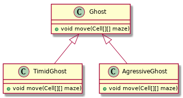
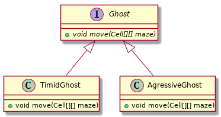

- [Polymorphisme dynamique](#org2ab0664)
  - [Polymorphisme statique](#org3bd2fa0)
  - [Polymorphisme dynamique](#org83cb400)
- [Exemple](#orgf3c2c83)
- [Héritage](#org103123e)
  - [Interface](#org9845ad1)
  - [Classe de base](#org9ce5b18)
  - [Classe abstraite](#org84bf4f8)
- [Qu'utiliser ? Interface ? Classe concrète ? Classe abstraite ?](#org4ebab35)
- [Webliographie](#orge7cb26c)
- [Annexe : code de l'exemple Pacman™](#orgd204c49)
  - [Cas avec seulement une interface](#org48c2d43)
  - [Cas avec une interface et une classe abstraite](#orge19397c)


<a id="org2ab0664"></a>

# Polymorphisme dynamique

Le *polymorphisme* en programmation, c'est la possibilité d'avoir plusieurs *implémentations* correspondant à un même nom, et que ce soit "la bonne" qui soit exécutée.

On distingue deux types de polymorphismes : le polymorphisme *statique* et le polymorphisme *dynamique*.


<a id="org3bd2fa0"></a>

## Polymorphisme statique

C'est lorsque le choix de l'implémentation a lieu à la compilation. Il y a deux types de polymorphisme statique en Java :

-   **la *surcharge de méthodes*:** c'est lorsque plusieurs méthodes d'une même classe <sup><a id="fnr.1" class="footref" href="#fn.1">1</a></sup> ont la même signature. Par exemple les méthodes `print` de la classe [java.io.PrintStream](https://docs.oracle.com/javase/8/docs/api/java/io/PrintStream.html).
-   **la *généricité*:** c'est lorsqu'on utilise la notation `<X>` pour paramétrer une classe ou une méthodes en fonction d'un type (de classe) donné. Le paramétrage est limité en Java car la seule chose qui change au niveau des implémentations, c'est la vérification de type.


<a id="org83cb400"></a>

## Polymorphisme dynamique

Comme on va le voir, c'est lorsqu'une méthode est *redéfinie* (et non pas *surchargée*), donc avec *la même signature*<sup><a id="fnr.2" class="footref" href="#fn.2">2</a></sup>, pour différentes classes d'une même *hiérarchie*.


<a id="orgf3c2c83"></a>

# Exemple

Supposons qu'on veuille implémenter un jeu de Pacman™. On doit pouvoir représenter les fantômes qui vont poursuivre le Pacman. S'ils ne se distinguaient que par leur vitesse ou même leur couleur, on pourrait simplement tous les implémenter par des instances d'une même classe avec seulement des valeurs différentes pour les attributs correspondants. Mais on veut pouvoir implémenter différentes stratégies de déplacement pour ces différents types de fantômes (par exemple dans la/les méthode[s] `move`).

Les deux "solutions" suivantes présentent chacunes des inconvénients :

-   implémenter tous les types de fantômes dans une même classe `Ghost`, et doter celle-ci d'un attribut d'instance `ghostType`. Ensuite, dans la méthode `move`, faire un `switch(ghostType)` pour exécuter le code correspondant au type du fantôme.
-   implémenter chaque type de fantôme dans une classe spécifique (e.g. `TimidGhost`, `AgressiveGhost`,…), chacune ayant son implémentation propre d'une méthode `move`.

Le problème de la première "solution" est que toutes les implémentations sont regroupées dans une même classe qu'il faut modifier pour pouvoir ajouter de nouveaux types. Le problème de la seconde est qu'on ne peut pas manipuler les différents types de façon uniforme (par exemple avoir une structure de données regroupant ensemble tous les fantômes pour appeler leur méthode `move`).


<a id="org103123e"></a>

# Héritage

C'est le même genre de problèmes qu'avaient les concepteurs de la bibliothèque standard de Java avec les différents types d'exceptions et les différents types de collections. La solution offerte par la *Programmation Orientée Objet* est de faire des classes spécifiques qui *héritent* d'une même classe parente (on parle aussi de classes dérivées d'une classe de base) et/ou qui implémentent une même interface.

-   **héritage d'une classe de base:** 



-   **héritage (implémentation) d'interface:** 




La relation d'héritage étant une relation "est un" (e.g. un TimidGhost "est un" Ghost), elle est transitive. Le dernier diagramme est donc équivalent à :


Grâce au [principe de substitution](https://fr.wikipedia.org/wiki/Principe_de_substitution_de_Liskov),la relation d'héritage étant de type "est un", tout ce qu'il est possible de faire avec une instance d'une classe de base est aussi possible avec une instance d'une classe dérivée. De même, pour qu'une classe implémente une interface, elle doit fournir des implémentations pour toutes les méthodes de l'interface. Ainsi, on pourra manipuler des objets à travers une référence vers l'interface (ou la classe de base) :

```java
1  // la liste en argument contient des objets de n'importe quelle classe
2  // implémentant l'interface Ghost (ou héritant de la classe Ghost).
3  public game(List<Ghost> ghosts, Cell[][] maze){
4      for(Ghost ghost : ghosts){
5  	ghost.move(maze);// c'est la bonne implémentation de move qui est appelée !
6      }
7  }
```

-   Le typage statique a permis à Java (le compilateur) de vérifier *à la compilation* (d'où le *statique*) que le code à la ligne 5 est correct, car tout ce que l'on fait à travers les références de type `Ghost` sera possible (cf. principe de substitution).

-   Le polymorphisme dynamique permet à Java (la JVM) de découvrir *à l'exécution* (d'où le *dynamique*) le code à exécuter pour effectuer l'appel à la méthode `move` à la ligne 5. Ce code pouvant être défini dans chacune des classes implémentant l'interface / héritant de la classe de base.


<a id="org9845ad1"></a>

## Interface

En Java, on déclare une [interface](https://en.wikipedia.org/wiki/Interface_(Java)) avec le mot-clé `interface` :

```java
1  public interface Ghost {
2      // public est optionel car les méthodes d'une interface sont par défaut publiques
3      public void move(Cell[][] maze);
4  }
```

Généralement, les méthodes déclarées dans une [interface](http://blog.paumard.org/cours/java/chap07-heritage-interface-interface.html) n'ont pas d'implémentation (à la ligne 3, on a un `;` au lieu d'un bloc de code avec l'implémentation). Depuis la version 8 de Java, les [interfaces](https://docs.oracle.com/javase/tutorial/java/IandI/createinterface.html) peuvent définir des [implémentations par défaut](https://dzone.com/articles/interface-default-methods-java). Par exemple, une implémentation par défaut qui ne ferait rien :

```java
1  public interface Ghost {
2      default public void move(Cell[][] maze){
3      }
4  }
```

Les interfaces ne peuvent pas contenir d'attributs d'instance, donc les éventuelles implémentations par défault ne peuvent pas

On indique ensuite comme suit qu'une classe implémente une interface :

```java
1  public class AgressiveGhost implements Ghost {
2      public void move(Cell[][] maze){
3  	/*
4  	  Ici, l'implémentation du déplacement d'un fantôme agressif
5  	 */
6      }
7  }
```

La signature de la méthode `move` dans l'implémentation de la classe `AgressiveGhost`, à la ligne 2 est (et doit être !) **exactement la même** que celle dans l'interface `Ghost` à la ligne 3. Il ne s'agit donc pas de *surcharge*, mais de *redéfinition*.

Une classe peut hériter de (implémenter) plusieurs interfaces et doit donc fournir des implémentations pour chacune des méthodes des interfaces implémentées pour lesquelles il n'y a pas d'implémentation par défaut. Si ces interfaces déclarent des implémentations par défaut pour la même méthode (avec la même signature, donc), il faut qu'elle déclare elle-même une implémentation pour lever l'ambiguïté.


<a id="org9ce5b18"></a>

## Classe de base

Une classe peut hériter (*étendre*) une classe (**et une seule**) de base quelconque :

```java
public class AgressiveGhost extends DefaultGhost {
    public void move(Cell[][] maze){
	/*
	 */
    }
}
```

Par ailleurs, si une classe ne déclare pas explicitement hériter d'une classe, elle hérite directement de la classe Object. Tout se passe comme si l'on écrivait `extends Object`. Comme la relation d'héritage est transitive, toutes les classes héritent donc, directement ou indirectement, de la classe Object.

Tout se passe alors comme si chaque instance de la classe dérivée 'contenait' une instance de la classe de base, avec tous les attributs et méthodes de celle-ci. Les attributs/méthodes déclarés en `private` dans la classe de base ne sont pas accessibles dans les classes dérivées, contrairement aux attributs `protected`. Il est possible de redéfinir les méthodes de la classe de base dans les classes dérivées. Par exemple, on redéfini les méthodes `equals` et `toString` héritées de la classe `Object`. Le polymorphisme dynamique assurant que ce soit toujours la méthode définie dans la classe la plus dérivée (la plus proche de la classe d'instanciation d'un objet en remontant dans la hiérarchie de classes parentes) qui sera exécutée.

Dans les constructeurs de la classe dérivée, la première chose à faire est d'appeler un constructeur de la classe parente avec un appel à `super(/*liste d'arguments éventuels*/)` . Sinon, tout se passe comme si le bloc d'implémentation du constructeur commençait par un appel implicite au constructeur par défaut (i.e. sans arguments) de la classe de base : `super()`.

Dans les méthodes, il est possible d'appeler les méthodes (accessibles) de la classe de base. Pour deśigner l'implémentation de la classe de base lorsqu'il y a une redéfinition dans la classe dérivée, on emploie le mot-clé `super` :

```java
public class AgressiveGhost extends DefaultGhost {
    public AgressiveGhost(){
	super(Color.RED);
    }
    public void move(Cell[][] maze){
	/*
	 */
	super.move(maze);
    }
}
```


<a id="org84bf4f8"></a>

## Classe abstraite

Les interfaces ne contiennent pas d'implémentation avec des attributs et les classes "normales" contiennent une implémentation complète et peuvent être instanciées. Il y a en Java un concept intermédiaire avec une implémentation partielle, qui ne peut être instanciée : la [*classe abstraite*](https://docs.oracle.com/javase/tutorial/java/IandI/abstract.html).

```java
public abstract class DefaultGhost {
    Color color;
    public DefaultGhost(Color color){
	this.color = color;
    }
    public abstract move(Cell[][] maze);
}
```

Une classe pourra hériter de celle-ci comme d'une classe normale, mais devra alors fournir des implémentations pour toutes les méthodes abstraites pour être elle-même concrète. La classe abstraite ne peut pas être instanciée et toute tentative d'appeler directement le constructeur provoquera une erreur de compilation.


<a id="org4ebab35"></a>

# Qu'utiliser ? Interface ? Classe concrète ? Classe abstraite ?

Pour garantir la plus grande réutilisabilité, il faut utiliser des *interfaces*. En effet, elles n'imposent aucune restriction car n'importe quelle nouvelle classe peut toujours implémenter une interface. En revanche, si deux bibliothèques ou *frameworks* imposaient chacun que les classes héritent d'une classe, il ne serait pas possible de faire une classe qui fonctionne simultanément avec les deux, puisqu'on ne peut hériter que d'une seule classe (mais implémenter autant d'interfaces qu'on veut).

Lorsque plusieurs classe, par exemple qui implémentent une même interface, ont de l'implémentation en commun, on peut factoriser celle-ci dans une parente. Généralement, celle-ci n'a pas vocation à être instanciée et l'on utilisera des classes abstraites. Dans l'exemple classique implémentant la taxonomie animale, pour un programme gérant des animaux :


Il est évident que des objets de classe `Mammal` ne devraient pas être instanciés : cette classe devrait donc être abstraite.

En pratique, l'héritage de classe concrète est souvent dû à une évolution de programme, lorsqu'on veut ajouter une nouvelle classe donc le comportement est suffisamment proche de celui d'une autre classe pour qu'on veuille réutiliser l'implémentation de celle-ci.


<a id="orge7cb26c"></a>

# Webliographie

-   [Explications sur l'héritage en Java](http://blog.paumard.org/cours/java/chap07-heritage-interface.html)
-   [Tutorial officiel Interfaces and Inheritance](https://docs.oracle.com/javase/tutorial/java/IandI/index.html)


<a id="orgd204c49"></a>

# Annexe : code de l'exemple Pacman™


<a id="org48c2d43"></a>

## Cas avec seulement une interface

```java
public interface Ghost {
    public Color getColor();
    public int getSpeed();
    public void move(Cell[][] maze);
}
```

```java
public class TimidGhost  implements Ghost {
    private Color color;
    private int speed;

    public TimidGhost(){
	color = Color.BLUE;
	speed = 2;
    }
    
    public Color getColor(){
	return color;
    }
    
    public int getSpeed(){
	return speed;
    }
    
    public void move(Cell[][] maze){
	/*
	  code pour s'approcher timidement du Pacman
	 */
    }
}
```

```java
public class AgressiveGhost  implements Ghost {
    private Color color;
    private int speed;

    public AgressiveGhost(){
	color = Color.RED;
	speed = 4;
    }
    
    public Color getColor(){
	return color;
    }
    
    public int getSpeed(){
	return speed;
    }
    
    public void move(Cell[][] maze){
	/*
	  code pour foncer sur le Pacman
	 */
    }
}
```

```java
public class Game {
    public int play(){
	/* 
	   code pour initialiser le plateau de jeu et les paramètres
	   comme la vitesse de jeu gameSpeed
	 */
	List<Ghost> ghosts = new ArrayList<Ghost>();
	ghost.add(new TimidGhost());
	ghosts.add(new AgressiveGhost());
	for(int turn=0; pacman.isAlive(); ++turn){
	    // déplacement des fantômes
	    for(Ghost ghost : ghosts){
		if(turn % (gameSpeed / ghost.getSpeed())){
		    ghost.move(maze);
		}
	    }
	    /*
	      code pour déplacer le pacman
	    */
	    /*
	      code pour afficher le labyrinthe
	      utilisant getColor() sur chaque ghost
	      */
	 }
	/* 
	   fin de partie, calcul du score
	*/
	return score;
    }
}
```


<a id="orge19397c"></a>

## Cas avec une interface et une classe abstraite

Le code présenté ci-dessus permet d'obtenir la modularité voulue : le code de la classe `Game` est parfaitement indépendant des implémentations des différents types de fantômes, et celles-ci sont parfaitement indépendantes les unes des autres. Cependant, une partie de ces dernières implémentations sont en fait les mêmes : tout ce qui concerne la couleur et la vitesse de nos fantômes. Plutôt que de dupliquer le code correspondant, on peut le factoriser dans une classe de base. On crée alors une classe abstraite `DefaultGhost` qui ne peut pas être instanciée car son implémentation de l'interface `Ghost` n'est que partielle : elle n'implémente pas la méthode `move` :

```java
public abstract class DefaultGhost implements Ghost{
    private Color color;
    private int speed;

    public AbstractGhost(Color color, int speed){
	this.color = color;
	this.speed = speed;
    }
    
    public Color getColor(){
	return color;
    }
    
    public int getSpeed(){
	return speed;
    }
    
}
    
```

```java
public class TimidGhost  extends DefaultGhost {

    public TimidGhost(){
	super(Color.BLUE, 2);
    }
    
    public void move(Cell[][] maze){
	/*
	  code pour s'approcher timidement du Pacman
	 */
    }
}
```

```java
public class AgressiveGhost  extends DefaultGhost {

    public AgressiveGhost(){
	super(Color.RED, 4);
    }
    
    public void move(Cell[][] maze){
	/*
	  code pour foncer sur le Pacman
	 */
    }
}
```

Le reste du code (interface `Ghost` et classe `Game`) est inchangé.

## Footnotes

<sup><a id="fn.1" class="footnum" href="#fnr.1">1</a></sup> ou d'une même *hiérarchie de
classes*. cf. infra.

<sup><a id="fn.2" class="footnum" href="#fnr.2">2</a></sup> Pour éviter de
se tromper dans la signature et de surcharger en croyant redéfinir,
Java permet d'utiliser l'annotation `@Override`
