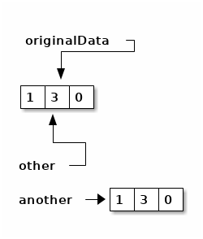

- [Références en Java](#orge5d4b1e)
- [Égalité et identité](#org93abc8a)
  - [Contra. types primitifs](#orgc88cea4)
    - [Déclaration](#orgd5b77ef)
    - [Affectation](#org904c0ec)
  - [Chaîne de caractères](#org1874f32)
    - [Déclaration](#orgd3ee510)
    - [Affectation](#org1f2e1da)
    - [Affectations](#org0b76050)
    - [Affectations 2](#orga33f798)
  - [Tableaux](#org79a9a71)
    - [Déclaration](#org8bf2406)
    - [Affectation](#org6ab36a5)
    - [Affectations](#org67ab569)
    - [Affectations 2](#orgb24e5a1)
  - [Objets](#orga59d306)
    - [Déclaration](#org4be0359)
    - [Affectation](#org4896538)
    - [Affectations](#orge9d89b0)
    - [Affectations 2](#orgeb1affb)
    - [equals()](#orgf9f878c)
- [Combinaisons](#org32e33b0)
  - [Tableaux de tableaux](#org3290128)
    - [Déclaration](#org8a4411e)
    - [Initialisation partielle](#org5ca679a)
    - [Initialisation](#orgaa8253d)
    - [Affectation](#org8ce2695)
    - [Copie superficielle](#org60590b7)
    - [Copie profonde](#orgb2053c4)
    - [Égalité](#org50846d0)
  - [Objets contenant des objets](#org9ef7bcb)
    - [Déclaration](#orge683464)
    - [Affectations](#org4f8ce81)
    - [clone()](#org408438c)
    - [constructeur par copie](#org653ae97)
  - [Remarque sur les objets de classes immuables](#org5e2682e)
  - [Tableaux d'objets](#org3845aa4)
- [Exercices](#org75c54b2)
  - [Tableau à deux dimensions de caractères](#org70993ea)
  - [Tableaux à deux dimensions d'objets](#org823cf0b)


<a id="orge5d4b1e"></a>

# Références en Java

Tous les objets et tous les tableaux sont manipulés à travers des **références**. En fait, elles correspondent à l'adresse d'un objet ou d'un tableau.


<a id="org93abc8a"></a>

# Égalité et identité

Si 'deux' valeurs sont au même endroit en mémoire, il s'agit en fait de la même valeurs : elles sont **identiques**.


<a id="orgc88cea4"></a>

## Contra. types primitifs

Des valeurs de types primitifs ne sont jamais **identiques**.


<a id="orgd5b77ef"></a>

### Déclaration

Si l'on exécute le code suivant:

```java
int score; // not a local variable
```

Il y a un `int` en mémoire.


<a id="org904c0ec"></a>

### Affectation

```java
int score= 0;
int other= score;
```

`score` et `other` sont des `int` **égaux**.


<a id="org1874f32"></a>

## Chaîne de caractères


<a id="orgd3ee510"></a>

### Déclaration

Si l'on exécute le code suivant:

```java
String firstname;
```

Il n'y a **AUCUNE** chaîne de caractères en mémoire.


<a id="org1f2e1da"></a>

### Affectation

```java
String firstname= "Bernard";
```


<a id="org0b76050"></a>

### Affectations

```java
String firstname= "Bernard";
String other= firstname;
```

`firstname` et `other` sont des chaînes de caractères **identiques**.


<a id="orga33f798"></a>

### Affectations 2

```java
String firstname= "Bernard";
String other= firstname;
String another= "Ber"+"nard";
```

`firstname` et `other` sont **identiques** entre elles et seulement **égales** à `another`.


<a id="org79a9a71"></a>

## Tableaux


<a id="org8bf2406"></a>

### Déclaration

Si l'on exécute le code suivant:

```java
int[] originalData;
```

Il n'y a **AUCUN** tableau en mémoire.


<a id="org6ab36a5"></a>

### Affectation

```java
int[] originalData= {1,3,0};
```


<a id="org67ab569"></a>

### Affectations

```java
int[] originalData= {1,3,0};
int[] other= originalData;
```

`originalData` et `other` sont des tableaux **identiques**.


<a id="orgb24e5a1"></a>

### Affectations 2

```java
int[] originalData= {1,3,0};
int[] other= originalData;
int[] another= {1,3,0};// or with new int[] and assignments
```

`originalData` et `other` sont **identiques** entre elles et seulement **égales** à `another`. Comment tester l'égalité ?




<a id="orga59d306"></a>

## Objets


<a id="org4be0359"></a>

### Déclaration

Si l'on exécute le code suivant:

```java
  public class Person{
      private String firstname;
      private String lastname;
      private int age;
      public Person(String firstname, String lastname, int age){
	  this.firstname= firstname;
	  this.lastname= lastname;
	  this.age= age;
      }
  }
```

```java
Person customer;
```

Il n'y a **AUCUN** objet de classe `Person` en mémoire.


<a id="org4896538"></a>

### Affectation

```java
Person customer= new Person("Clark", "Kent", 42);
```


<a id="orge9d89b0"></a>

### Affectations

```java
Person customer= new Person("Clark", "Kent", 42);
Person other= customer;
```

`customer` et `other` sont des objets **identiques**.


<a id="orgeb1affb"></a>

### Affectations 2

```java
Person customer= new Person("Clark", "Kent", 42);
Person other= customer;
Person another= new Person("Clark", "Kent", 42);
```

`customer` et `other` sont **identiques** entre elles et seulement **égales** à `another`. Comment tester l'égalité ?


<a id="orgf9f878c"></a>

### equals()

On redéfini la méthode [equals(Object other)](https://docs.oracle.com/javase/8/docs/api/java/lang/Object.html#equals-java.lang.Object-):

```java
  public class Person{
      private String firstname;
      private String lastname;
      private int age;
      public Person(String firstname, String lastname, int age){
	  this.firstname= firstname;
	  this.lastname= lastname;
	  this.age= age;
      }
      public boolean equals(Object other){
	  if(other != null && (other instanceof Person)){
	      Person otherPerson= (Person) other;
	      if(firstname.equals(otherPerson.firstname) 
	      && lastname.equals(otherPerson.lastname)
		 && (age == otherPerson.age)){
		  return true;
	      }
	  }
	  return false;
      }
  }
```

Analyser et comprendre chacune des opérations de cette méthode.


<a id="org32e33b0"></a>

# Combinaisons


<a id="org3290128"></a>

## Tableaux de tableaux


<a id="org8a4411e"></a>

### Déclaration

Avec une simple déclaration, il n'y a **aucun** tableau en mémoire.

```java
int[][] data;
```


<a id="org5ca679a"></a>

### Initialisation partielle

Si l'on ne crée qu'un seul tableau, il n'y a qu'un tableau qui **pourra** contrenir des références vers des tableaux.

```java
int[][] data= new int[2][];
```


<a id="orgaa8253d"></a>

### Initialisation

Il faut initialiser chacune des cases de tableau de tableaux.

```java
int[][] data= new int[2][];
for(int i=0; i != data.length; ++i){
  data[i]= new int[2+i];
}
```


<a id="org8ce2695"></a>

### Affectation

Si l'on ne crée pas d'autres tableaux, il n'y a pas d'autre tableau !

```java
int[][] data= new int[2][];
for(int i=0; i != data.length; ++i){
  data[i]= new int[2+i];
}
int [][] other= data;
```


<a id="org60590b7"></a>

### Copie superficielle

Si l'on ne copie que le tableau de tableaux, seul celui-ci est recopié, pas son contenu.

```java
int[][] data= new int[2][];
for(int i=0; i != data.length; ++i){
  data[i]= new int[2+i];
}
int [][] other= new int[data.length][];
for(int i=0; i != data.length; ++i){
  other[i]= data[i];
}
```


<a id="orgb2053c4"></a>

### Copie profonde

```java
  public static int[][] deepCopy(int[][] data){
      int [][] result= new int[data.length][];
      for(int i=0; i != data.length; ++i){
	  result[i]= new int[data[i].length];
	  for(int =0; j != data[i].length; ++j){
	      result[i][j]= data[i][j];
	  }
      }
      return result;
  }
```


<a id="org50846d0"></a>

### Égalité

Comment tester l'égalité ?


<a id="org9ef7bcb"></a>

## Objets contenant des objets

Soit la classe (problématique) suivante :

```java
public class ProgrammingPair {
  private Person driver;
  private Person navigator;
  public Person getDriver(){ return driver;}
  public void setDriver(Person driver){ this.driver= driver;}
  public Person getNavigator(){ return navigator;}
  public void setNavigator(Person navigator){ this.navigator= navigator;}

}
```


<a id="orge683464"></a>

### Déclaration

Encore une fois, la simple déclaration ne crée aucun objet.

```java
ProgrammingPair pair;
```


<a id="org4f8ce81"></a>

### Affectations

```java
ProgrammingPair pair= new ProgrammingPair();
```


```java
ProgrammingPair pair= new ProgrammingPair();
pair.setDriver(new Person("Clark", "Kent", 42));
pair.setNavigator(new Person("Lex", "Luthor", 45));
```


```java
ProgrammingPair pair= new ProgrammingPair();
pair.setDriver(new Person("Clark", "Kent", 42));
pair.setNavigator(new Person("Lex", "Luthor", 45));
ProgrammingPair other= pair;
```


```java
ProgrammingPair pair= new ProgrammingPair();
pair.setDriver(new Person("Clark", "Kent", 42));
pair.setNavigator(new Person("Lex", "Luthor", 45));
ProgrammingPair other= new ProgrammingPair();
other.setDriver(pair.getDriver());
other.setNavigator(pair.getNavigator());
```


<a id="org408438c"></a>

### clone()

Pour construire un nouvel objet qui est une copie, il a été conventionnel d'utiliser une méthode `clone`.

```java
  public ProgrammingPair clone(){
      return new ProgrammingPair(driver, navigator); // this cstor should exist anyway !
  }
```

```java
ProgrammingPair pair= new ProgrammingPair("Clark", "Kent", 42);
ProgrammingPair other= pair.clone();
```

En fait, on utilise plutôt [un constructeur par copie](https://www.artima.com/intv/bloch13.html).


<a id="org653ae97"></a>

### constructeur par copie

```java
  public ProgrammingPair(ProgrammingPair other){
      driver= new Person(other.driver);
      navigator= new Person(other.navigator);
  }
```


<a id="org5e2682e"></a>

## Remarque sur les objets de classes immuables

L'intérêt de créer des copies, plutôt que de partager des références sur des objets identiques, est d'assurer l'indépendance entre la copie et l'original : aucune modification de l'un n'aura d'impacts sur l'autre.

Dans le cas d'objets qui ne peuvent pas être modifiés car ils sont des instances de classes *immuables* (*immutable*), il n'y a pas d'inconvénients à avoir des objets identiques. Ainsi, on considère la copie de instances des classes `ProgrammingPair` et des classes `Person` comme profondes même si les attributs contiennent des références vers des objets de classe `String` identiques :


<a id="org3845aa4"></a>

## Tableaux d'objets

Écrire une classe `Seminar` qui comporte:

-   un attribut `coach` de type `Person`
-   un attribut `attendents` de type "tableau de Person"


<a id="org75c54b2"></a>

# Exercices


<a id="org70993ea"></a>

## Tableau à deux dimensions de caractères

Que fait le programme suivant ? Pourquoi ? Comment le corriger (pour qu'il affiche une croix) ?

```java
public class DebugArr2D {
    public static char[] initializedArray(char c, int nb){
	char[] res= new char[nb];
	for(int i=0; i != res.length; ++i){
	    res[i]= c;
	}
	return res;
    }
    public static char[][] initializedArray2D(char[] arr, int nb){
	char[][] res= new char[nb][];
	for(int i=0; i != res.length; ++i){
	    res[i]= arr;
	}
	return res;
    }
    public static void display(char[][] arr2D){
	for(char[] row : arr2D){
	    for(char c : row){
		System.out.print(c);
	    }
	    System.out.println();
	}
    }
    public static void main(String[] args){
	char[][] screen= initializedArray2D(initializedArray(' ', 20), 20);
	for(int i= 0; i != Math.min(screen.length, screen[0].length); ++i){
	    screen[i][i]='X';
	    screen[screen.length-i-1][i]='X';
	}
	display(screen);
    }
}
```


<a id="org823cf0b"></a>

## Tableaux à deux dimensions d'objets

Que fait le programme suivant ? Pourquoi ? Comment le corriger (pour qu'il affiche une croix) ?

```java
class Stone{
    private boolean firstPlayer;
    public Stone(boolean firstPlayer) {
	this.firstPlayer= firstPlayer;
    }
    public boolean isFirstPlayer() {
	return firstPlayer;
    }
    public void setFirstPlayer(boolean firstPlayer) {
	this.firstPlayer= firstPlayer;
    }
    public String toString() {
	return firstPlayer ? "O":"X";
    }
}
```

```java
public class DebugArray2DObjects {
    public static Stone[] initializedArray(Stone s, int nb){
	Stone[] res= new Stone[nb];
	for(int i=0; i != res.length; ++i){
	    res[i]= s;
	}
	return res;
    }
    public static Stone[][] initializedArray2D(Stone[] arr, int nb){
	Stone[][] res= new Stone[nb][];
	for(int i=0; i != res.length; ++i){
	    res[i]= arr;
	}
	return res;
    }
    public static void display(Stone[][] board){
	for(Stone[] row : board){
	    for(Stone c : row){
		System.out.print(c);
	    }
	    System.out.println();
	}
    }
    public static void main(String[] args){
	Stone[][] screen= initializedArray2D(initializedArray(new Stone(false), 20), 20);
	for(int i= 0; i != Math.min(screen.length, screen[0].length); ++i){
	    screen[i][i].setFirstPlayer(true);
	    screen[screen.length-i-1][i].setFirstPlayer(true);
	}
	display(screen);
    }
}
```
