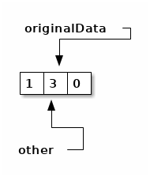
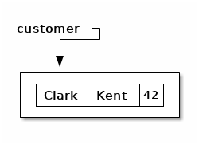

- [Références en Java](#orgcc24045)
- [Égalité et identité](#org04b8d01)
  - [Contra. types primitifs](#org6deed97)
    - [Déclaration](#org6fa15b5)
    - [Affectation](#org69968ed)
  - [Chaîne de caractères](#org3e7409d)
    - [Déclaration](#org8d2bb04)
    - [Affectation](#orgf34507d)
    - [Affectations](#orged669e9)
    - [Affectations 2](#org8fe3f64)
  - [Tableaux](#org92aefc9)
    - [Déclaration](#orgffec61b)
    - [Affectation](#org2405a33)
    - [Affectations](#orgada9548)
    - [Affectations 2](#org2722826)
  - [Objets](#org4f21e06)
    - [Déclaration](#org4cce3a5)
    - [Affectation](#orgb1784cc)
    - [Affectations](#orgdecb114)
    - [Affectations 2](#orga046ab3)
    - [equals()](#org20fd195)
- [Combinaisons](#org0c36c10)
  - [Tableaux de tableaux](#orge333a3e)
    - [Déclaration](#orge3e90fd)
    - [Initialisation partielle](#orgce9f0c1)
    - [Initialisation](#org0177d34)
    - [Affectation](#orgec97c35)
    - [Copie superficielle](#orgf82605b)
    - [Copie profonde](#orgc12c95a)
    - [Égalité](#org79a372e)
  - [Objets contenant des objets](#orgf464bb8)
    - [Déclaration](#org7254739)
    - [Affectations](#org0867b1c)
    - [clone()](#orgfdd8d0e)
    - [constructeur par copie](#org48e4e52)
  - [Tableaux d'objets](#orgfa7e8c8)
- [Exercices](#orgc40d00f)
  - [Tableau à deux dimensions de caractères](#org19687fa)
  - [Tableaux à deux dimensions d'objets](#orgba52d71)


<a id="orgcc24045"></a>

# Références en Java

Tous les objets et tous les tableaux sont manipulés à travers des **références**. En fait, elles correspondent à l'adresse d'un objet ou d'un tableau.


<a id="org04b8d01"></a>

# Égalité et identité

Si 'deux' valeurs sont au même endroit en mémoire, il s'agit en fait de la même valeurs : elles sont **identiques**.


<a id="org6deed97"></a>

## Contra. types primitifs

Des valeurs de types primitifs ne sont jamais **identiques**.


<a id="org6fa15b5"></a>

### Déclaration

Si l'on exécute le code suivant:

```java
int score; // not a local variable
```

Il y a un `int` en mémoire.


<a id="org69968ed"></a>

### Affectation

```java
int score= 0;
int other= score;
```

`score` et `other` sont des `int` **égaux**.


<a id="org3e7409d"></a>

## Chaîne de caractères


<a id="org8d2bb04"></a>

### Déclaration

Si l'on exécute le code suivant:

```java
String firstname;
```

Il n'y a **AUCUNE** chaîne de caractères en mémoire.


<a id="orgf34507d"></a>

### Affectation

```java
String firstname= "Bernard";
```


<a id="orged669e9"></a>

### Affectations

```java
String firstname= "Bernard";
String other= firstname;
```

`firstname` et `other` sont des chaînes de caractères **identiques**.


<a id="org8fe3f64"></a>

### Affectations 2

```java
String firstname= "Bernard";
String other= firstname;
String another= "Ber"+"nard";
```

`firstname` et `other` sont **identiques** entre elles et seulement **égales** à `another`.


<a id="org92aefc9"></a>

## Tableaux


<a id="orgffec61b"></a>

### Déclaration

Si l'on exécute le code suivant:

```java
int[] originalData;
```

Il n'y a **AUCUN** tableau en mémoire.


<a id="org2405a33"></a>

### Affectation

```java
int[] originalData= {1,3,0};
```


<a id="orgada9548"></a>

### Affectations

```java
int[] originalData= {1,3,0};
int[] other= originalData;
```

`originalData` et `other` sont des tableaux **identiques**.




<a id="org2722826"></a>

### Affectations 2

```java
int[] originalData= {1,3,0};
int[] other= originalData;
int[] another= {1,3,0};// or with new int[] and assignments
```

`originalData` et `other` sont **identiques** entre elles et seulement **égales** à `another`. Comment tester l'égalité ?


<a id="org4f21e06"></a>

## Objets


<a id="org4cce3a5"></a>

### Déclaration

Si l'on exécute le code suivant:

```java
  public class Person{
      String firstname;
      String lastname;
      int age;
      public Person(String firstname, String lastname, int age){
	  this.firstname= firstname;
	  this.lastname= lastname;
	  this.age= age;
      }
  }
```

```java
Person customer;
```

Il n'y a **AUCUN** objet de classe `Person` en mémoire.


<a id="orgb1784cc"></a>

### Affectation

```java
Person customer= new Person("Clark", "Kent", 42);
```




<a id="orgdecb114"></a>

### Affectations

```java
Person customer= new Person("Clark", "Kent", 42);
Person other= customer;
```

`customer` et `other` sont des objets **identiques**.


<a id="orga046ab3"></a>

### Affectations 2

```java
Person customer= new Person("Clark", "Kent", 42);
Person other= customer;
Person another= new Person("Clark", "Kent", 42);
```

`customer` et `other` sont **identiques** entre elles et seulement **égales** à `another`. Comment tester l'égalité ?


<a id="org20fd195"></a>

### equals()

On redéfini la méthode [equals(Object other)](https://docs.oracle.com/javase/8/docs/api/java/lang/Object.html#equals-java.lang.Object-):

```java
  public class Person{
      String firstname;
      String lastname;
      int age;
      public Person(String firstname, String lastname, int age){
	  this.firstname= firstname;
	  this.lastname= lastname;
	  this.age= age;
      }
      public boolean equals(Object other){
	  if(other != null && (other instanceof Person)){
	      Person otherPerson= (Person) other;
	      if(firstname.equals(otherPerson.firstname) 
	      && lastname.equals(otherPerson.lastname)
		 && (age == otherPerson.age)){
		  return true;
	      }
	  }
	  return false;
      }
  }
```

Analyser et comprendre chacune des opérations de cette méthode.


<a id="org0c36c10"></a>

# Combinaisons


<a id="orge333a3e"></a>

## Tableaux de tableaux


<a id="orge3e90fd"></a>

### Déclaration

Avec une simple déclaration, il n'y a **aucun** tableau en mémoire.

```java
int[][] data;
```


<a id="orgce9f0c1"></a>

### Initialisation partielle

Si l'on ne crée qu'un seul tableau, il n'y a qu'un tableau qui **pourra** contrenir des références vers des tableaux.

```java
int[][] data= new int[2][];
```


<a id="org0177d34"></a>

### Initialisation

Il faut initialiser chacune des cases de tableau de tableaux.

```java
int[][] data= new int[2][];
for(int i=0; i != data.length; ++i){
  data[i]= new int[2+i];
}
```


<a id="orgec97c35"></a>

### Affectation

Si l'on ne crée pas d'autres tableaux, il n'y a pas d'autre tableau !

```java
int[][] data= new int[2][];
for(int i=0; i != data.length; ++i){
  data[i]= new int[2+i];
}
int [][] other= data;
```


<a id="orgf82605b"></a>

### Copie superficielle

Si l'on ne copie que le tableau de tableaux, seul celui-ci est recopié, pas son contenu.

```java
int[][] data= new int[2][];
for(int i=0; i != data.length; ++i){
  data[i]= new int[2+i];
}
int [][] other= new int[data.length][];
for(int i=0; i != data.length; ++i){
  other[i]= data[i];
}
```


<a id="orgc12c95a"></a>

### Copie profonde

```java
  public static int[][] deepCopy(int[][] data){
      int [][] result= new int[data.length][];
      for(int i=0; i != data.length; ++i){
	  result[i]= new int[data[i].length];
	  for(int =0; j != data[i].length; ++j){
	      result[i][j]= data[i][j];
	  }
      }
      return result;
  }
```


<a id="org79a372e"></a>

### Égalité

Comment tester l'égalité ?


<a id="orgf464bb8"></a>

## Objets contenant des objets

Soit la classe (problématique) suivante :

```java
public class ProgrammingPair {
  Person driver;
  Person navigator;
  public Person getDriver(){ return driver;}
  public void setDriver(Person driver){ this.driver= driver;}
  public Person getNavigator(){ return navigator;}
  public void setNavigator(Person navigator){ this.navigator= navigator;}

}
```


<a id="org7254739"></a>

### Déclaration

Encore une fois, la simple déclaration ne crée aucun objet.

```java
ProgrammingPair pair;
```


<a id="org0867b1c"></a>

### Affectations

```java
ProgrammingPair pair= new ProgrammingPair();
```


```java
ProgrammingPair pair= new ProgrammingPair();
pair.setDriver(new Person("Clark", "Kent", 42));
pair.setNavigator(new Person("Lex", "Luthor", 45));
```


```java
ProgrammingPair pair= new ProgrammingPair();
pair.setDriver(new Person("Clark", "Kent", 42));
pair.setNavigator(new Person("Lex", "Luthor", 45));
ProgrammingPair other= originalPair;
```


```java
ProgrammingPair pair= new ProgrammingPair();
pair.setDriver(new Person("Clark", "Kent", 42));
pair.setNavigator(new Person("Lex", "Luthor", 45));
ProgrammingPair other= new ProgrammingPair();
other.setDriver(pair.getDriver());
other.setNavigator(pair.getNavigator());
```


<a id="orgfdd8d0e"></a>

### clone()

Pour construire un nouvel objet qui est une copie, il est conventionnel d'utiliser une méthode `clone`.

```java
  public ProgrammingPair clone(){
      return new ProgrammingPair(driver, navigator); // this cstor should exist anyway !
  }
```

```java
ProgrammingPair pair= new ProgrammingPair("Clark", "Kent", 42);
ProgrammingPair other= pair.clone();
```


En fait, on utilise souvent [un constructeur par copie](https://www.artima.com/intv/bloch13.html).


<a id="org48e4e52"></a>

### constructeur par copie

```java
  public ProgrammingPair(ProgrammingPair other){
      driver= new Person(other.driver);
      navigator= new Person(other.navigator);
  }
```

Écrire une classe `Seminar` qui comporte:

-   un attribut `coach` de type `Person`
-   un attribut `attendents` de type "tableau de Person"


<a id="orgfa7e8c8"></a>

## Tableaux d'objets

Écrire une classe `Seminar` qui comporte:

-   un attribut `coach` de type `Person`
-   un attribut `attendents` de type "tableau de Person"


<a id="orgc40d00f"></a>

# Exercices


<a id="org19687fa"></a>

## Tableau à deux dimensions de caractères

Que fait le programme suivant ? Pourquoi ? Comment le corriger (pour qu'il affiche une croix) ?

```java
  public class DebugArr2D {
      public static char[] initializedArray(char c, int nb){
	  char[] res= new char[nb];
	  for(int i=0; i != res.length; ++i){
	      res[i]= c;
	  }
	  return res;
      }
      public static char[][] initializedArray2D(char[] arr, int nb){
	  char[][] res= new char[nb][];
	  for(int i=0; i != res.length; ++i){
	      res[i]= arr;
	  }
	  return res;
      }
```

```java
      public static void display(char[][] arr2D){
	  for(char[] row : arr2D){
	      for(char c : row){
		  System.out.print(c);
	      }
	      System.out.println();
	  }
      }
      public static void main(String[] args){
	  char[][] screen= initializedArray2D(initializedArray(' ', 20), 20);
	  for(int i= 0; i != Math.min(screen.length, screen[0].length); ++i){
	      screen[i][i]='X';
	      screen[screen.length-i-1][i]='X';
	  }
	  display(screen);
      }
  }
```


<a id="orgba52d71"></a>

## Tableaux à deux dimensions d'objets

Que fait le programme suivant ? Pourquoi ? Comment le corriger (pour qu'il affiche une croix) ?

```java
class Stone{
	private boolean firstPlayer;
	public Stone(boolean firstPlayer) {
		this.firstPlayer= firstPlayer;
	}
	public boolean isFirstPlayer() {
		return firstPlayer;
	}
	public void setFirstPlayer(boolean firstPlayer) {
		this.firstPlayer= firstPlayer;
	}
	public String toString() {
		return firstPlayer ? "O":"X";
	}
}

```

```java
public class DebugArray2DObjects {
    public static Stone[] initializedArray(Stone s, int nb){
	  Stone[] res= new Stone[nb];
	  for(int i=0; i != res.length; ++i){
	      res[i]= s;
	  }
	  return res;
    }
    public static Stone[][] initializedArray2D(Stone[] arr, int nb){
	  Stone[][] res= new Stone[nb][];
	  for(int i=0; i != res.length; ++i){
	      res[i]= arr;
	  }
	  return res;
    }
```

```java
	public static void display(Stone[][] board){
		  for(Stone[] row : board){
		      for(Stone c : row){
			  System.out.print(c);
		      }
		      System.out.println();
		  }
	    }
	 public static void main(String[] args){
		  Stone[][] screen= initializedArray2D(initializedArray(new Stone(false), 20), 20);
		  for(int i= 0; i != Math.min(screen.length, screen[0].length); ++i){
		      screen[i][i].setFirstPlayer(true);
		      screen[screen.length-i-1][i].setFirstPlayer(true);
		  }
		  display(screen);
	    }
}

```
