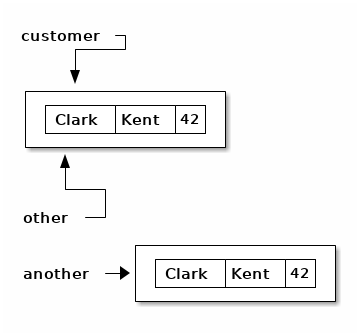

- [Références en Java](#orgcd5e50d)
- [Égalité et identité](#org7643368)
  - [Contra. types primitifs](#orgf04bc5c)
    - [Déclaration](#org4c4f9e0)
    - [Affectation](#org94b4ffb)
  - [Chaîne de caractères](#orgaeb2254)
    - [Déclaration](#orga941052)
    - [Affectation](#org1f86adc)
    - [Affectations](#org6ff4abe)
    - [Affectations 2](#org67b999b)
  - [Tableaux](#org946d135)
    - [Déclaration](#org67a64a1)
    - [Affectation](#org575a2ad)
    - [Affectations](#orgaf9f0da)
    - [Affectations 2](#org8df3c52)
  - [Objets](#orged78e18)
    - [Déclaration](#org5f6f791)
    - [Affectation](#orgc486367)
    - [Affectations](#orgf9750b7)
    - [Affectations 2](#org6eff766)
    - [equals()](#org7dd926d)
- [Combinaisons](#org07d36a1)
  - [Tableaux de tableaux](#org465fa7f)
    - [Déclaration](#org64ba011)
    - [Initialisation partielle](#orgb58b3bc)
    - [Initialisation](#orgd6ef2dc)
    - [Affectation](#orgfc81736)
    - [Copie superficielle](#org080d67a)
    - [Copie profonde](#org1260ea8)
    - [Égalité](#org8c25100)
  - [Objets contenant des objets](#orgc577570)
    - [Déclaration](#org34d3073)
    - [Affectations](#orgae63091)
    - [clone()](#org35dcc00)
    - [constructeur par copie](#orga80679c)
  - [Tableaux d'objets](#org1303b13)
- [Exercices](#org66de5df)
  - [Tableau à deux dimensions de caractères](#org3eefe1b)
  - [Tableaux à deux dimensions d'objets](#org46b7cd0)


<a id="orgcd5e50d"></a>

# Références en Java

Tous les objets et tous les tableaux sont manipulés à travers des **références**. En fait, elles correspondent à l'adresse d'un objet ou d'un tableau.


<a id="org7643368"></a>

# Égalité et identité

Si 'deux' valeurs sont au même endroit en mémoire, il s'agit en fait de la même valeurs : elles sont **identiques**.


<a id="orgf04bc5c"></a>

## Contra. types primitifs

Des valeurs de types primitifs ne sont jamais **identiques**.


<a id="org4c4f9e0"></a>

### Déclaration

Si l'on exécute le code suivant:

```java
int score; // not a local variable
```

Il y a un `int` en mémoire.


<a id="org94b4ffb"></a>

### Affectation

```java
int score= 0;
int other= score;
```

`score` et `other` sont des `int` **égaux**.


<a id="orgaeb2254"></a>

## Chaîne de caractères


<a id="orga941052"></a>

### Déclaration

Si l'on exécute le code suivant:

```java
String firstname;
```

Il n'y a **AUCUNE** chaîne de caractères en mémoire.


<a id="org1f86adc"></a>

### Affectation

```java
String firstname= "Bernard";
```


<a id="org6ff4abe"></a>

### Affectations

```java
String firstname= "Bernard";
String other= firstname;
```

`firstname` et `other` sont des chaînes de caractères **identiques**.


<a id="org67b999b"></a>

### Affectations 2

```java
String firstname= "Bernard";
String other= firstname;
String another= "Ber"+"nard";
```

`firstname` et `other` sont **identiques** entre elles et seulement **égales** à `another`.


<a id="org946d135"></a>

## Tableaux


<a id="org67a64a1"></a>

### Déclaration

Si l'on exécute le code suivant:

```java
int[] originalData;
```

Il n'y a **AUCUN** tableau en mémoire.


<a id="org575a2ad"></a>

### Affectation

```java
int[] originalData= {1,3,0};
```


<a id="orgaf9f0da"></a>

### Affectations

```java
int[] originalData= {1,3,0};
int[] other= originalData;
```

`originalData` et `other` sont des tableaux **identiques**.


<a id="org8df3c52"></a>

### Affectations 2

```java
int[] originalData= {1,3,0};
int[] other= originalData;
int[] another= {1,3,0};// or with new int[] and assignments
```

`originalData` et `other` sont **identiques** entre elles et seulement **égales** à `another`. Comment tester l'égalité ?


<a id="orged78e18"></a>

## Objets


<a id="org5f6f791"></a>

### Déclaration

Si l'on exécute le code suivant:

```java
  public class Person{
      private String firstname;
      private String lastname;
      private int age;
      public Person(String firstname, String lastname, int age){
	  this.firstname= firstname;
	  this.lastname= lastname;
	  this.age= age;
      }
  }
```

```java
Person customer;
```

Il n'y a **AUCUN** objet de classe `Person` en mémoire.


<a id="orgc486367"></a>

### Affectation

```java
Person customer= new Person("Clark", "Kent", 42);
```


<a id="orgf9750b7"></a>

### Affectations

```java
Person customer= new Person("Clark", "Kent", 42);
Person other= customer;
```

`customer` et `other` sont des objets **identiques**.


<a id="org6eff766"></a>

### Affectations 2

```java
Person customer= new Person("Clark", "Kent", 42);
Person other= customer;
Person another= new Person("Clark", "Kent", 42);
```

`customer` et `other` sont **identiques** entre elles et seulement **égales** à `another`. Comment tester l'égalité ?




<a id="org7dd926d"></a>

### equals()

On redéfini la méthode [equals(Object other)](https://docs.oracle.com/javase/8/docs/api/java/lang/Object.html#equals-java.lang.Object-):

```java
  public class Person{
      private String firstname;
      private String lastname;
      private int age;
      public Person(String firstname, String lastname, int age){
	  this.firstname= firstname;
	  this.lastname= lastname;
	  this.age= age;
      }
      public boolean equals(Object other){
	  if(other != null && (other instanceof Person)){
	      Person otherPerson= (Person) other;
	      if(firstname.equals(otherPerson.firstname) 
	      && lastname.equals(otherPerson.lastname)
		 && (age == otherPerson.age)){
		  return true;
	      }
	  }
	  return false;
      }
  }
```

Analyser et comprendre chacune des opérations de cette méthode.


<a id="org07d36a1"></a>

# Combinaisons


<a id="org465fa7f"></a>

## Tableaux de tableaux


<a id="org64ba011"></a>

### Déclaration

Avec une simple déclaration, il n'y a **aucun** tableau en mémoire.

```java
int[][] data;
```


<a id="orgb58b3bc"></a>

### Initialisation partielle

Si l'on ne crée qu'un seul tableau, il n'y a qu'un tableau qui **pourra** contrenir des références vers des tableaux.

```java
int[][] data= new int[2][];
```


<a id="orgd6ef2dc"></a>

### Initialisation

Il faut initialiser chacune des cases de tableau de tableaux.

```java
int[][] data= new int[2][];
for(int i=0; i != data.length; ++i){
  data[i]= new int[2+i];
}
```


<a id="orgfc81736"></a>

### Affectation

Si l'on ne crée pas d'autres tableaux, il n'y a pas d'autre tableau !

```java
int[][] data= new int[2][];
for(int i=0; i != data.length; ++i){
  data[i]= new int[2+i];
}
int [][] other= data;
```


<a id="org080d67a"></a>

### Copie superficielle

Si l'on ne copie que le tableau de tableaux, seul celui-ci est recopié, pas son contenu.

```java
int[][] data= new int[2][];
for(int i=0; i != data.length; ++i){
  data[i]= new int[2+i];
}
int [][] other= new int[data.length][];
for(int i=0; i != data.length; ++i){
  other[i]= data[i];
}
```


<a id="org1260ea8"></a>

### Copie profonde

```java
  public static int[][] deepCopy(int[][] data){
      int [][] result= new int[data.length][];
      for(int i=0; i != data.length; ++i){
	  result[i]= new int[data[i].length];
	  for(int =0; j != data[i].length; ++j){
	      result[i][j]= data[i][j];
	  }
      }
      return result;
  }
```


<a id="org8c25100"></a>

### Égalité

Comment tester l'égalité ?


<a id="orgc577570"></a>

## Objets contenant des objets

Soit la classe (problématique) suivante :

```java
public class ProgrammingPair {
  private Person driver;
  private Person navigator;
  public Person getDriver(){ return driver;}
  public void setDriver(Person driver){ this.driver= driver;}
  public Person getNavigator(){ return navigator;}
  public void setNavigator(Person navigator){ this.navigator= navigator;}

}
```


<a id="org34d3073"></a>

### Déclaration

Encore une fois, la simple déclaration ne crée aucun objet.

```java
ProgrammingPair pair;
```


<a id="orgae63091"></a>

### Affectations

```java
ProgrammingPair pair= new ProgrammingPair();
```


```java
ProgrammingPair pair= new ProgrammingPair();
pair.setDriver(new Person("Clark", "Kent", 42));
pair.setNavigator(new Person("Lex", "Luthor", 45));
```


```java
ProgrammingPair pair= new ProgrammingPair();
pair.setDriver(new Person("Clark", "Kent", 42));
pair.setNavigator(new Person("Lex", "Luthor", 45));
ProgrammingPair other= originalPair;
```


```java
ProgrammingPair pair= new ProgrammingPair();
pair.setDriver(new Person("Clark", "Kent", 42));
pair.setNavigator(new Person("Lex", "Luthor", 45));
ProgrammingPair other= new ProgrammingPair();
other.setDriver(pair.getDriver());
other.setNavigator(pair.getNavigator());
```


<a id="org35dcc00"></a>

### clone()

Pour construire un nouvel objet qui est une copie, il a été conventionnel d'utiliser une méthode `clone`.

```java
  public ProgrammingPair clone(){
      return new ProgrammingPair(driver, navigator); // this cstor should exist anyway !
  }
```

```java
ProgrammingPair pair= new ProgrammingPair("Clark", "Kent", 42);
ProgrammingPair other= pair.clone();
```


En fait, on utilise plutôt [un constructeur par copie](https://www.artima.com/intv/bloch13.html).


<a id="orga80679c"></a>

### constructeur par copie

```java
  public ProgrammingPair(ProgrammingPair other){
      driver= new Person(other.driver);
      navigator= new Person(other.navigator);
  }
```


<a id="org1303b13"></a>

## Tableaux d'objets

Écrire une classe `Seminar` qui comporte:

-   un attribut `coach` de type `Person`
-   un attribut `attendents` de type "tableau de Person"


<a id="org66de5df"></a>

# Exercices


<a id="org3eefe1b"></a>

## Tableau à deux dimensions de caractères

Que fait le programme suivant ? Pourquoi ? Comment le corriger (pour qu'il affiche une croix) ?

```java
public class DebugArr2D {
    public static char[] initializedArray(char c, int nb){
	char[] res= new char[nb];
	for(int i=0; i != res.length; ++i){
	    res[i]= c;
	}
	return res;
    }
    public static char[][] initializedArray2D(char[] arr, int nb){
	char[][] res= new char[nb][];
	for(int i=0; i != res.length; ++i){
	    res[i]= arr;
	}
	return res;
    }
    public static void display(char[][] arr2D){
	for(char[] row : arr2D){
	    for(char c : row){
		System.out.print(c);
	    }
	    System.out.println();
	}
    }
    public static void main(String[] args){
	char[][] screen= initializedArray2D(initializedArray(' ', 20), 20);
	for(int i= 0; i != Math.min(screen.length, screen[0].length); ++i){
	    screen[i][i]='X';
	    screen[screen.length-i-1][i]='X';
	}
	display(screen);
    }
}
```


<a id="org46b7cd0"></a>

## Tableaux à deux dimensions d'objets

Que fait le programme suivant ? Pourquoi ? Comment le corriger (pour qu'il affiche une croix) ?

```java
class Stone{
    private boolean firstPlayer;
    public Stone(boolean firstPlayer) {
	this.firstPlayer= firstPlayer;
    }
    public boolean isFirstPlayer() {
	return firstPlayer;
    }
    public void setFirstPlayer(boolean firstPlayer) {
	this.firstPlayer= firstPlayer;
    }
    public String toString() {
	return firstPlayer ? "O":"X";
    }
}
```

```java
public class DebugArray2DObjects {
    public static Stone[] initializedArray(Stone s, int nb){
	Stone[] res= new Stone[nb];
	for(int i=0; i != res.length; ++i){
	    res[i]= s;
	}
	return res;
    }
    public static Stone[][] initializedArray2D(Stone[] arr, int nb){
	Stone[][] res= new Stone[nb][];
	for(int i=0; i != res.length; ++i){
	    res[i]= arr;
	}
	return res;
    }
    public static void display(Stone[][] board){
	for(Stone[] row : board){
	    for(Stone c : row){
		System.out.print(c);
	    }
	    System.out.println();
	}
    }
    public static void main(String[] args){
	Stone[][] screen= initializedArray2D(initializedArray(new Stone(false), 20), 20);
	for(int i= 0; i != Math.min(screen.length, screen[0].length); ++i){
	    screen[i][i].setFirstPlayer(true);
	    screen[screen.length-i-1][i].setFirstPlayer(true);
	}
	display(screen);
    }
}
```
