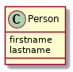

- [Objectifs](#orgb8303dc)
- [Préliminaires](#orgb71462d)
- [Permettre les tests d'égalité entre instances](#orge3beec8)
  - [Définir une méthode equals(Person p)](#org9b7c643)
  - [Définir une méthode equals(Object o)](#org735e739)
- [Implémentation d'interface](#org9fd07d6)
  - [Implémentation de l'interface Comparable](#orgab50fca)
  - [Implémentation de l'interface Comparable<Person>](#org42eb079)


<a id="orgb8303dc"></a>

# Objectifs

Pratiquer la redéfinition de méthodes et l'implémentation d'interfaces.


<a id="orgb71462d"></a>

# Préliminaires

Créer une classe Person :



Avec un constructeur qui permette d'initialiser les attributs.


<a id="orge3beec8"></a>

# Permettre les tests d'égalité entre instances


<a id="org9b7c643"></a>

## Définir une méthode equals(Person p)

On pourrait être tenté de définir une méthode `public boolean equals(Person p)`.

Définir une telle méthode et essayer de l'utiliser :

```java
    Person p1 = new Person ("Bernard", "h");
    Person p2 = new Person("Bernard", "h");
    System.out.println(p1.equals(p2));
```

Puis comme ceci :

```java
    Object p1 = new Person ("Bernard", "h");
    Object p2 = new Person("Bernard", "h");
    System.out.println(p1.equals(p2));
```

Expliquer le deuxième résultat.

On a voulu redéfinir la méthode `equals` définie dans la classe [Object](https://docs.oracle.com/javase/10/docs/api/java/lang/Object.html). On peut indiquer cette intention de *redéfinir* une méthode avec l'[annotation @Override](https://www.baeldung.com/java-override). Qualifier la méthode `public boolean equals(Person p)` avec l'annotation `@Override` : que se passe-t-il ?


<a id="org735e739"></a>

## Définir une méthode equals(Object o)

Il faut se persuader que le deuxième cas de figure (lorsque l'on manipule un objet de classe `Person` à travers une référence de classe `Object` qui est la plus utile ! En effet, à chaque fois qu'une classe déjà existante (par exemple les structures de données de la bibliothèque standard Java (e.g. `ArrayList` ou `TreeSet`), elle ne peut évidemment pas avoir été écrite ou même compilée en prenant en compte notre nouvelle classe. On doit donc pouvoir gérer ce cas de figure, en redéfinissant vraiment (et non en surchargeant) la méthode [equals](https://docs.oracle.com/javase/10/docs/api/java/lang/Object.html#equals(java.lang.Object)) définie dans la classe [Object](https://docs.oracle.com/javase/10/docs/api/java/lang/Object.html).

Redéfinir la méthode `public boolean equals(Object o)`. Vérifier que le code suivant donne cette fois-ci le résultat attendu :

```java
    Object p1 = new Person ("Bernard", "h");
    Object p2 = new Person("Bernard", "h");
    System.out.println(p1.equals(p2));
```


<a id="org9fd07d6"></a>

# Implémentation d'interface

On voudra désormais en plus être capable d'ordonner des instances de notre classe `Person` (ordre alphabétique sur `lastname` puis sur `firstname` en cas d'égalité), par exemple pour pouvoir exécuter le code suivant :

```java
    TreeSet<Person> group= new TreeSet<Person>();
    group.add(new Person("Bernard","H"));
    group.add(new Person("Jules", "L"));
    System.out.println(group);

```

Quel est le message d'erreur à l'exécution ?


<a id="orgab50fca"></a>

## Implémentation de l'interface Comparable

Implémenter l'interface Comparable [Comparable](https://docs.oracle.com/javase/10/docs/api/java/lang/Comparable.html) avec une méthode `public int compareTo(Object o)`.


<a id="org42eb079"></a>

## Implémentation de l'interface Comparable<Person>

Implémenter l'interface [Comparable<Person>](https://docs.oracle.com/javase/10/docs/api/java/lang/Comparable.html). Quels sont les avantages par rapport à l'implémentation précédente ?
