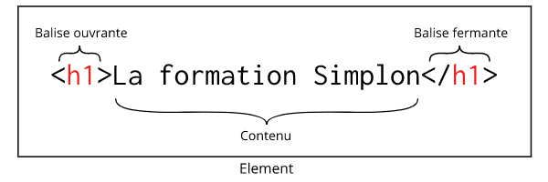
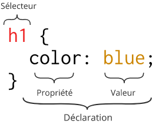
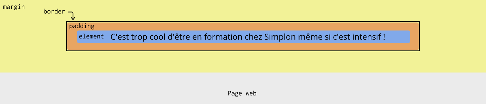

# La base des application Web avec HTML et CSS

## Comment ça marche

De nos jours, on utilise énormément d'applications Web ! Mais comment ça marche ? Sur quels concepts sont-elles basées ?

### Internet vs Web

Tout d'abord, il est nécessaire de savoir dissocier **Web** et **Internet**.

**Internet** est le réseau informatique mondial sur lequel se basent plusieurs services tels que le courrier électronique, la messagerie instantanée ou le World Wide Web. Le **Web** quant à lui permet de consulter des pages qui sont mises à disposition par des sites. Le Web se base donc sur Internet.

### Consultation de pages Web

Grâce à un navigateur internet, on peut consulter les pages qui sont mises à disposition par les sites. Ces pages sont envoyées au format **HTML** (le contenu de la page), agrémentées de différentes feuilles de styles écrites en **CSS** (la mise en forme de la page) et très souvent dynamisées à l'aide de scripts écrits en **JavaScript**. Ces pages sont aussi souvent accompagnées de ressources (images, vidéos, sons, ...).

Le navigateur Web récupère les pages Web grâce au **protocole HTTP(S)**. Il contacte le serveur et récupère les pages grâce aux différentes adresses que l'on rentre dans la barre d'adresse de notre navigateur.

Dans l'exemple suivant, Jules et Bernard rentrent l'adresse github.com dans leur navigateur. Jonathan rentre l'adresse simplon.co.


Chaque navigateur web cherche l'adresse physique du site demandé avec le protocole DNS en se basant sur l'URL (_simplon.co_ ou _github.com_) fournie. Une fois l'URL transformée en adresse IP, le navigateur envoie une requête HTTP au serveur pour récupérer le contenu disponible à cette adresse. Si l'adresse est correcte alors le serveur renvoie le contenu dans le navigateur du client.

Une fois les ressources récupérées, le navigateur les interprète et utilise un moteur de rendu pour transformer le texte HTML et CSS afin d'afficher un résultat à l'écran.

### L'interprétation du contenu des pages Web

Ce qui est retourné par le site est interprété par le navigateur web.

Lorsque nous avons vu les bases du langage Java, nous avons compilé nos premiers programmes. Nous avons transformé des fichiers de code source `.java` en d'autres fichiers `.class` qui sont directement interprétables par la machine virtuelle Java.

Dans le cas des pages Web en HTML, pas besoin de compilation. En effet, le HTML est un langage interprété. Essayez de créer une fichier `index.html` à l'emplacement de votre choix sur votre PC. Mettez-y le contenu suivant :

```html
<!DOCTYPE html>
<html>
  <head>
    <meta charset="utf-8">
    <title>Formation Simplon</title>
  </head>
  <body>
    <p>Je suis en formation chez Simplon, ne pas me déranger !</p>
  </body>
</html>
```

Maintenant, ouvrez ce fichier avec votre navigateur préféré (Google Chrome, Mozilla Firefox, ...). Vous remarquerez que son contenu s'affiche dans votre navigateur et vous n'avez pas eu besoin de le compiler. Le navigateur **interprète** directement le HTML.

C'est le même fonctionnement avec les fichiers CSS et JavaScript. Les fichiers de code source sont envoyés directement du serveur vers le client et le navigateur les interprète directement.

**Remarque :** si vous ouvrer le fichier depuis votre PC il n'y a qu'un client (et pas de serveur). Le navigateur charge le fichier HTML depuis votre PC directement.

## Le HTML

Le HTML est le langage qui permet de décrire le **contenu** des pages Web. C'est un langage de balises. Il ne s'agit pas d'un langage de programmation. On ne spécifie aucune instruction en HTML.

Il est important de noter qu'on ne s'occupe pas de mise en forme en HTML. C'est uniquement le contenu de nos pages que l'on y définit !

### L'histoire du HTML

Le langage HTML a été créé par [Sir Timothy John Berners-Lee](https://fr.wikipedia.org/wiki/Tim_Berners-Lee) qui est un des principaux inventeurs du [World Wide Web](https://fr.wikipedia.org/wiki/World_Wide_Web). Il a commencé à travailler sur ce langage au [CERN](https://fr.wikipedia.org/wiki/Organisation_europ%C3%A9enne_pour_la_recherche_nucl%C3%A9aire) à la fin des années 1980. La première version qui "sortira" du CERN sera la version HTML 2.0 en 1995. Viendront ensuite les version 3 en 1995 et 4 en 1997. La version actuelle d'HTML est la version 5 depuis 2014.

### Les commentaires

Comme dans tout langage, on peut (et il vaut mieux !) écrire des commentaires pour documenter son code. On les écrit de cette façon :

```html
<!-- Ceci est mon commentaire -->
```

### Les balises

Les balises permettent d'organiser le contenu de nos pages web. Chaque balise permet de donner un sens à notre contenu.

Je veux par exemple décrire la formation Simplon avec un titre et un petit paragraphe. Je peux utiliser les balises suivantes :

```html
<h1>La formation Simplon</h1>
<p>La formation Simplon est une formation en alternance, intensive et inclusive.</p>
```

#### La structure d'une balise

J'utilise les balises `<h1>` et `<p>` respectivement pour le titre et le paragraphe.

Voici la structure d'un élément HTML :



Toutes les données qu'on souhaite afficher sont à répartir dans les  différentes balises de nos fichiers HTML.

#### Les attributs

On peut aussi spécifier des attributs dans les balises. Les attributs permettent de donner plus d'informations sur la balise sans que ces informations s'affichent dans la page. Je peux par exemple afficher un lien vers le site de Simplon dans ma page web. Je peux utiliser le code suivant :

```html
<a href="http://simplon.co">Simplon.co</a>
```

Ici, j'utilise la balise `<a>` pour spécifier mon lien. Et j'ai besoin de spécifier vers quel site ce lien pointe. J'utilise donc l'attribut `href` de la balise pour indiquer où pointe le lien. En effet, l'utilisateur de mon site n'a pas besoin de connaître l'adresse du site Simplon mais il veut juste pouvoir cliquer sur le lien pour visiter la page.

#### Les éléments vides

Certains éléments n'ont pas de contenu textuel. Prenons l'exemple des images. Il y a simplement une image à charger depuis les ressources du site.

```html

```

J'utilise l'attribut `src` pour spécifier la localisation de mon image par rapport à mon fichier HTML. J'utilise aussi l'attribut `alt` pour décrire l'image. Il est important de spécifier cet attribut car il permet aux personnes visuellement handicapées de savoir ce qu'il y a dans l'image et aussi de décrire l'image si le chargement ne fonctionne pas (si le chemin n'est pas correct ou si la ressource n'existe pas).

#### L'imbrication des balises

Les balises html peuvent s'imbriquer. On peut par exemple utiliser la balise `<strong>` qui sert à donner de l'importance à un passage de texte dans un paragraphe pour insister sur un mot. On placera alors la balise `<strong>` à l'intérieur de la balise `<p>`.

Exemple :

```html
<p>La formation Simplon est une formation en alternance, <strong>intensive et inclusive.</strong></p>
```

#### Le type de balise (inline vs block)

On distingue deux grands types de balises :

- Les balises **block** qui forment un bloc sur la page. A chaque nouveau bloc, le contenu se place sur une nouvelle ligne. La balise `<p>` est une balise de type block. Les élements block peuvent être imbriqués les uns dans les autres.
- Les balises **inline** qui se placent sur une même ligne. La balise `<strong>` est un élément de type inline. Attetion : on ne peut pas imbriquer un élément de type block dans un élément de type inline !

#### La structure de base d'un fichier HTML

Reprenons l'exemple présenté plus haut :

```html
<!DOCTYPE html>
<html>
  <head>
    <meta charset="utf-8">
    <title>Formation Simplon</title>
  </head>
  <body>
    <p>Je suis en formation chez Simplon, ne pas me déranger !</p>
  </body>
</html>
```

On y voit les élements suivants :

- Le **DOCTYPE** : C'est une balise qui avait initialement pour objectif de faire la différence entre les règles de validation qu'on pouvait utiliser pour valider les fichiers HTML. Aujourd'hui on ne s'en sert plus mais on décrit toujours le DOCTYPE pour s'assurer que notre fichier sera lisible sur les anciens navigateurs.
- La balise `<html>` qui est la racine du document. C'est l'élément qui englobe tous les autres.
- La balise `<head>` qui contient des informations sur le document et qui ne seront pas affichées dans la page. Il s'agit du titre de la page, de l'encodage utilisé pour la page, ...
- La balise `<body>` qui contiendra tout le contenu visible de la page.

#### Les principales balises de texte

##### Les titres

En HTML on peut définir jusqu'à 6 niveaux de titres : de `<h1>` jusqu'à `<h6>`. Le niveau du titre permet de spécifier leur importance. Le titre `<h1>` est un titre très très important. Le titre `<h6>` est un titre peu important.

Exemple :

```html
<h1>Titre super important !!!</h1>
<h3>Titre assez important !</h3>
<h6>Titre pas vraiment important...</h6>
```

Le niveau du titre ne sert en aucun cas à la mise en forme. Il s'agit de donner du sens au titre. La mise en forme sera faite en CSS.

##### Les paragraphes

Rien de compliqué ici, pour créer un paragraphe de texte, il suffit de placer sont texte entre les balises `<p>` et `<\p>`.

Exemple :

```html
<p>Les programmes de formation Simplon sont trop cools, il y a la bonne ambiance et en plus on apprend plein de trucs cools !</p>
```

##### Les listes

Pour lister des données on peut utiliser :

- des listes ordonnées avec `ol`
- des listes non ordonnées avec `ul`

Exemple :

```html
<p>Les formateurs Simplon Corp Java :</p>
<ul>
  <li>Bernard</li>
  <li>Josselin</li>
  <li>Philippe</li>
  <li>Jules</li>
</ul>
```

##### Les liens

Voir l'exemple vu plus haut sur les [attributs](#les-attributs).

##### Les tableaux

On peut aussi structurer ses données avec un tableau. On crée un tableau avec la balise `<table>`. On peut donner un titre à son tableau avec la balise `<caption>`. Ensuite on structure son tableau avec les balises `<thead>`, `<tbody>` et `<tfoot>`.

`<thead>` permet de décrire l'en tête du tableau, `<tbody>` permet de décrire son contenu, `<tfoot>` permet de décrire le bas de page du tableau.

Pour décrire les données on utilise les balises `<tr>` pour décrire une ligne et `<td>` pour décrire une cellule.

Exemple :

```html
<table>
  <caption>Liste des apprenants Simplon</caption>
  <thead>
    <tr>
      <th scope="col">Nom</th>
      <th scope="col">Prénom</th>
      <th scope="col">Origine</th>
    </tr>
  </thead>
  <tbody>
    <tr>
      <td>Jobs</td>
      <td>Steve</td>
      <td>Etats-Unis</td>
    </tr>
    <tr>
      <td>Gates</td>
      <td>Bill</td>
      <td>Etats-Unis</td>
    </tr>
    <tr>
      <td>Ma</td>
      <td>Jack</td>
      <td>Chine</td>
    </tr>
  </tbody>
</table>
```

**Remarque :** Il est important de noter qu'on ne doit surtout pas utiliser de tableau pour faire la mise en page de son site. C'était une pratique courante lorsque CSS n'était pas assez bien supporté par les navigateurs. Mais de nos jours ce n'est plus le cas !

Tout ça c'est sympa mais le texte ça ne fait pas tout ! Si on mettait un peu d'images et de vidéos ?

#### Le contenu multimédia

##### Les images

Voir l'exemple vu plus haut sur les [éléments vides](#les-éléments-vides).

##### Le contenu vidéo ou audio

On peut inclure du contenu audio ou vidéo grâce aux balises `<audio>` et `<video>`. Dans l'exemple suivant l'attribut `controls` permet de spécifier au navigateur qu'il doit afficher une barre de contrôles pour lire, avancer, mettre en pause, ... On spécifie la source de notre fichier audio avec la balise `<source>`. On peut spécifier plusieurs sources sous différents formats. Le navigateur chargera le premier fichier qu'il arrive à lire. Enfin le paragraphe rajouté est affiché si le navigateur n'est pas capable de lire le fichier audio.

```html
<audio controls>
  <source src="song.mp3" type="audio/mp3">
  <source src="song.ogg" type="audio/ogg">
  <p>Votre navigateur ne peut pas lire le contenu audio. Vous pouvez le télécharger via ce <a href="song.mp3">lien</a>.</p>
</audio>
```

#### Les formulaires

Les formulaires permettent d'interagir avec l'utilisateur•ice. Ils permettent à l'utilisateur•ice de saisir des données que l'on peut ensuite envoyer au serveur. La récupération des données et leur traitement implique de développer une routine de traitement des données. Nous verrons cet aspect serveur avec Java EE. Ici nous allons nous concentrer sur la conception d'un formulaire en HTML.

##### Créer son formulaire

La balise `<form>` permet de définir un formulaire. Il s'agit seulement d'une boite vide qu'il faut ensuite remplir avec différents champs de formulaire.
Il est important de bien comprendre les attributs `action` et `method` de la balise `form` :

- `action` permet de faire le lien avec la page qui traitera les informations collectées par le formulaire.
- `method` permet de choisir la méthode HTTP qui se chargera de l'envoi des données (cela peut être `get` ou `post` et c'est très généralement `post`).

Dans l'exemple suivant, c'est la page `traitement` qui collectera les données et ce sera fait via la méthode `post`.

```html
<form action="/traitement" method="post">

</form>
```

Une fois que nous avons posé la structure du formulaire il faut le remplir avec des champs à compléter.

Prenons l'exemple d'un formulaire écrit pour l'exemple de l'application de gestion des apprenants Simplon :

```html
<form action="traitement" method="post">
  <!-- Last name field -->
  <label for="last_name">Last Name</label>
  <input placeholder="Jobs" id="last_name" type="text" name="last_name">
  <!-- First name field -->
  <label for="first_name">First Name</label>
  <input placeholder="Bill" id="first_name" type="text" name="first_name">
  <!-- Origin country field -->
  <label>Origin</label>
  <select>
    <option value="" disabled selected>Choose your origin country</option>
    <option value="1">China</option>
    <option value="2">France</option>
    <option value="3">United Kingdom</option>
    <option value="4">United States of America</option>
  </select>
  <!-- Submit button -->
  <button type="submit">Add</button>
</form>
```

Chaque balise a une fonction bien définie :

- `<label>` décrit un champ. On utilise l'attribut `for` pour faire le lien avec le champ en question (le lien se fait sur l'attribut `id` du champ à lier).
- `<input>` définit une entrée de type zone de texte, mot de passe, adresse email, ... On choisit le type de données à rentrer avec l'attribut `type`. On étiquette aussi les données qui seront à envoyer au serveur avec l'attribut `name`.
- `<select>` affiche une liste déroulante dont les valeurs seront contenues dans les différentes balises `<option>`.
- `<button>` définit une action sur le formulaire. L'attribut `type` permet de définir laquelle. _Submit_ permet d'envoyer le formulaire, _reset_ permet de vider les champs du formulaire.

##### Quelques bonnes pratiques

- Donner un titre à son formulaire
- Rester simple (demander uniquement ce qui est vital)
- Découper son formulaire s'il y a beaucoup de champs
- Grouper les champs
- Choisir le bon type d'input (text, email, password, ...)
- Utiliser l'attribut `placeholder` pour donner un exemple
- Offrir des suggestions (essayer la balise `<datalist>`)
- Mettre en valeur le bouton de validation

Bien d'autres astuces sont utiles lorsqu'on met en place des formulaires. Lisez par exemple l'article de Google sur le sujet : [Create Amazing Forms](https://developers.google.com/web/fundamentals/design-and-ux/input/forms/)

Ceci n'est qu'un aperçu de toutes les possibilités qu'offrent les forumlaires HTML. Pour plus de détails sur les formulaires :

- [Une liste d'articles sur MDN](https://developer.mozilla.org/fr/docs/Web/Guide/HTML/Formulaires)
- [Les formulaires HTML sur OpenClassrooms](https://openclassrooms.com/courses/apprenez-a-creer-votre-site-web-avec-html5-et-css3/les-formulaires-8)

## Le CSS

Tout ça est intéressant mais ce n'est pas très joli. Heureusement on peut associer des fichiers CSS aux fichiers HTML pour faire la mise en forme des pages.

Le CSS, comme HTML, n'est pas un langage de programmation. En effet on n'écrit pas d'instruction. Il permet d'appliquer des styles sur des éléments de nos fichiers HTML.

Afin d'appliquer une feuille de style à un fichier HTML, il faut appliquer indiquer dans la balise `<head>` de notre fichier HTML que nous voulons intégrer une feuille de style CSS.

```html
<link href="styles/style.css" rel="stylesheet">
```

Ceci fait, la navigateur appliquera la feuille de style `style.css` à notre page HTML.

### Les règles CSS

Un premier exemple de fichier CSS :

```css
h1 {
  color: blue;
}
```

Détaillons ce fichier :



Ici plusieurs choses se passent :

- Le selecteur `h1` permet de spécifier que les règles que l'on va écrire entre les accolades s'appliqueront à tous les éléments `<h1>` de notre page HTML.
- La déclaration `color: blue` permet de spécifier que tout nos éléments `<h1>` devront être de couleur bleue. On appelle cela une règle.
- Le mot clé `color` est une propriété.
- Le mot clé `blue` est une valeur. On aurait pu ici définir la couleur en hexadécimal ou sous forme RGB.

#### Les différents sélecteurs

##### Sélecteur d'élément

Dans notre premier exemple nous avons appliqué une règle à tous nos éléments `<h1>` de notre fichier HTML. C'est bien mais c'est un peu limité, si nous voulons par exemple avoir une mise en forme différente pour deux titres `<h1>` différents, c'est impossible. Heureusement CSS est beaucoup plus puissant que ça et nous propose un grand nombre de sélecteurs !

##### Sélecteur de classe

Je veux par exemple avoir deux couleurs de titres `<h1>`, un rouge et un bleu, en fonction du contenu que je vais y mettre.

Je peux procéder de la manière suivante :
Mon fichier HTML ressemble à ça :

```html
<!-- En tête du fichier non écrit pour plus de lisibilité -->
<h1 class="cold-location">Laponie</h1>

<h1 class="hot-location">Maroc</h1>

<h1 class="hot-location">Thaïlande</h1>

```

Et mon fichier CSS à ça :

```css
.cold-location {
  color: blue;
}

.hot-location {
  color: red;
}
```

Ceci nous permet de découvrir l'attribut `class` qu'on peut spécifier dans une balise HTML. Cet attribut est **universel**, ce qui signifie qu'on peut le définir dans n'importe quelle balise HTML. L'attribut `class` permet de catégoriser certaines balises.

Dans mon fichier HTML tous les titres de classe `hot-location` seront écrits en rouge, tous les titres `cold-location` seront écrits en bleu.

##### Sélecteur d'ID

On peut aussi se servir de l'attribut `id` qu'on peut spécifier dans une balise HTML pour identifier de manière unique un élément.

On pourrait faire :

```html
<!-- En tête du fichier non écrit pour plus de lisibilité -->
<h1 id="boss">Hanifa</h1>

<h1>Bernard</h1>

<h1>Jules</h1>

```

Et mon fichier CSS à ça :

```css
#boss {
  color: gold;
}
```

#### La combinaison des sélecteurs

##### Sélecteur d'élément fils

Parfois on veut associer une style seulement à une partie de notre page web. On pourrait par exemple vouloir afficher différement les **liens** affichés dans un **paragraphe**. Dans ce cas on peut utiliser le selecteur d'élément fils `p>a`:

Par exemple :

```html
<a href="#">Revenir à l'accueil</a>

<p>
  Il était une fois un langage informatique qui permettait de définir des pages web. Ce langage c'est le
  <a href="https://fr.wikipedia.org/wiki/Hypertext_Markup_Language">HTML</a>.
</p>

```

```css
p>a {
  color: gold;
}
```

Ainsi dans ma page HTML tous les liens de type `<a>` qui sont déclarés directement sous un paragraphe seront affichés en couleur dorée !

##### Sélecteur d'élément descendant

De manière très similaire on peut appliquer une règle un peu moins stricte qui est celle de l'élément descendant.

Reprenons le même cas, mais avec en plus la mise en valeur du **lien** avec la balise `<strong>` si j'utilise le sélecteur d'élement fils alors mon lien ne sera plus en doré car mon lien n'est plus directement sous une balise `<p>` mais sous le `<strong>`.

Si l'on utilise le sélecteur d'élement descendant `p a`, on aura de nouveau la mise en forme de notre lien. Tous les liens descendants d'un paragraphe seront affichés en doré :

```html
<a href="#">Revenir à l'accueil</a>

<p>
  Il était une fois un langage informatique qui permettait de définir des pages web. Ce langage c'est le 
  <strong><a href="https://fr.wikipedia.org/wiki/Hypertext_Markup_Language">HTML</a></strong>.
</p>

```

```css
p a {
  color: gold;
}
```

Les possibilités sont vraiment larges, car on peut en plus combiner les sélecteurs. Pour tout savoir sur les sélecteurs CSS, vous trouverez d'excellentes informations sur [MDN](https://developer.mozilla.org/fr/docs/Web/CSS/Sélecteurs_CSS).

#### Les différentes propriétés CSS

Dans les précédents exemples, je n'ai utilisé que la propriété `color`. Mais beaucoup d'autres propriétés existent.

Nous allons voir quelques exemples de propriétés qui permettent de définir un peu plus la mise en forme de nos éléments.

Une notion importante à comprendre est le modèle des boites. En effet, la plupart des composants HTML peuvent être assimilés à des boites que l'on peut empiler les unes sur les autres. Chaque boite peut être dimensionnée selon nos préférences. Prenons l'exemple d'un paragraphe de texte : on peut définir les propriétés :

- `border` pour ajouter une bordure autour de l'élément
- `padding` pour laisser de l'espace entre le texte est la bordure
- `margin` pour ajouter de l'espace entre notre bloc `<p>` et les autres blocs de la page
- `text-align` pour centrer notre texte dans le paragraphe
- `width` pour définir la largeur de notre bloc `<p>`

Voici un exemple :

```html
<p>
  C'est cool d'être en formation à Simplon même si c'est intensif !
</p>
```

Et mon fichier CSS à ça :

```css
p {
  border: 2px solid black;
  margin: auto;
  padding: 10px 5px;
  text-align: center;
  width: 500px;
}
```

On peut schématiser ce bloc `<p>` de cette façon :



Pour plus de détails, n'hésitez pas à visiter [MDN](https://developer.mozilla.org/fr/Apprendre/CSS).
