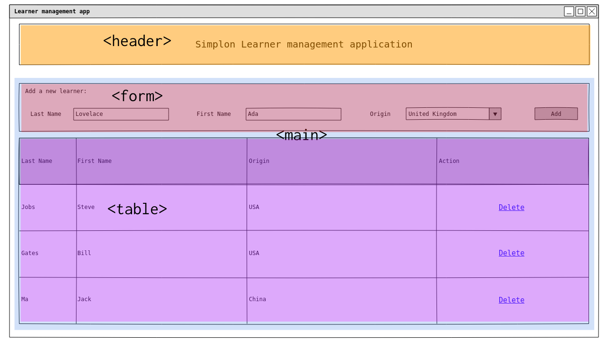
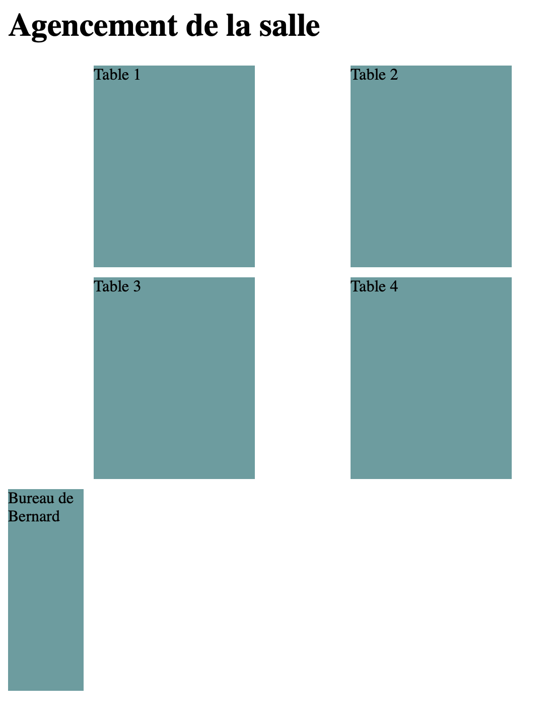

# Structurer ses pages web

## HTML : La sémantique

### C'est quoi la sémantique

La sémantique est d'après le dictionnaire Larousse :

> l'étude du **sens** des unités linguistiques et de leurs combinaisons.

En **HTML** notre but est de définir du **contenu**. Il est donc important de pouvoir définir le **sens** de chaque élément. Est-ce que mon élément est un titre, un paragraphe, un item d'une liste ?

La majorité des balises ont un **sens**. La balise `<p>` délimite un "paragraphe", `<h1>` délimite un "titre très important", ... Cela nous permet de définir le sens de notre contenu.

Certaines balises HTML ont pour but de mettre en forme le contenu. C'est le cas des balises `<i>`, `<b>` ou `<center>`. Cependant comme CSS est aujourd'hui bien supporté par les navigateurs, il est **déconseillé** de les utiliser. En effet il est conseillé de bien séparer notre contenu de sa mise en forme. Si un contenu est important, on peut l'indiquer avec la balise `<strong>` qui signifie "mise en valeur forte" et décider de la mise en forme de la balise dans notre fichier CSS associé.

```html
<!-- Bon exemple -->
<p>La sémantique est <strong>très</strong> importante.</p>

<!-- Mauvais exemple -->
<p>La sémantique est <b>très</b> importante.</p>
```

Enfin, quelques balises n'ont pas de sens. C'est le cas par exemple des balises `<div>` et `<span>`. Ce sont des balises **neutres**. La balise `<div>` est de type **block** alors que `<span>` est de type **inline**.

### Depuis HTML5, des balises de structure

Si vous vous baladez souvent sur le web, vous avez du remarquer que la majorité des sites ont la même structure : un bandeau en haut de page, un menu de navigation, un corps de page avec le contenu et un pied de page.

Les personnes qui ont participé à l'élaboration d'HTML5 avaient fait ce constat et ont intégré à HTML5 de nouvelles balises structurantes permettant de délimiter les différentes zones d'un site.

Illustrons leur possible emploi sur l'exemple de mon application de gestion des apprenants Simplon :



On utilise la balise `<header>` pour définir le bandeau supérieur de l'application. On utilise la balise `<main>` pour placer le contenu principal de la page.

On aurait aussi pu utiliser les balises suivantes :

- `<nav>` si nous voulions afficher un menu de navigation.
- `<section>` si nous avions eu plusieurs sections à délimiter.
- `<article>` si nous voulions afficher des articles dans notre page.
- `<footer>` si nous voulions ajouter un pied de page.

### Pourquoi utiliser les balises sémantiques

#### Pour l'accessibilité

Une des raisons pour lesquelles bien structurer son site avec des balises sémantiques est que les personnes visuellement handicapées utilisent des lecteurs d'écran pour visiter les sites. Un site **bien structuré** est **facilement lisible** par les lecteurs d'écrans et cela permet de repérer facilement les différentes parties du site (où se trouve le menu, où est le contenu, ...).

#### Pour le Search Engine Optimization (SEO)

Utiliser les balises sémantiques pour structurer ses pages HTML est aussi une bonne pratique pour s'assurer que son site sera bien référencé. En effet, les moteurs de recherche scannent les pages Web et analysent si nos pages web sont bien structurées. C'est un des critères de notation des sites et cela peut faire monter le site dans les résultats de recherche.

Pour plus de détails sur la sémantique des pages Web :

- [La structure des sites sur MDN](https://developer.mozilla.org/fr/Apprendre/HTML/Introduction_%C3%A0_HTML/Document_and_website_structure)
- [Structurer sa page sur OpenClassrooms](https://openclassrooms.com/courses/apprenez-a-creer-votre-site-web-avec-html5-et-css3/structurer-sa-page)

## CSS : La mise en page

### Bien gérer sa mise en page

Avant l'apparition de [Flexbox](https://developer.mozilla.org/fr/docs/Web/CSS/CSS_Flexible_Box_Layout/Concepts_de_base_flexbox) ou [CSS Grid](https://developer.mozilla.org/fr/docs/Web/CSS/CSS_Grid_Layout), les développeur•euse•s front s'arrachaient souvent les cheveux pour agencer les pages comportant plusieurs composants. Il faut dire qu'au début, HTML et CSS n'étaient pas prévus pour concevoir des interfaces graphiques. Alors il a fallu un peu de temps avant d'avoir des outils simples pour gérer sa mise en page. Mais aujourd'hui grâce à ces outils, c'est devenu plus facile de gérer la mise en page.

Dans la majorité des cas, l'utilisation de **Flexbox** qui est un modèle de disposition unidimensionnel suffit à disposer correctement les composants sur une page web. Dans des cas d'interface un peu plus complexes, on peut utiliser **CSS Grid** qui est lui bidimensionnel.

### Flexbox

Flexbox va nous permettre de gérer l'affichage de nos composants en ligne ou en colonne. Pour ce faire, il faut spécifier le type d'affichage que nous souhaitons avoir dans l'élement contenant ceux que l'on souhaite organiser.

Exemple : je souhaite afficher un menu sous forme d'une liste de différentes actions possible de manière horizontale. Si j'utilise la balise `<ul>` avec des sous balises `<li>` par défaut, j'ai un affichage en colonne. Grâce à flexbox je peux afficher mon menu en colonne :

```html
<h1>Mon application</h1>
<ul>
    <li>Menu 1</li>
    <li>Menu 2</li>
    <li>Menu 3</li>
</ul>
```

```css
ul {
    display: flex;
    flex-direction: row;
    justify-content: center;
}

li {
    list-style-type: none;
    padding: 10px;
}
```

### CSS Grid

CSS grid permet de gérer l'agencement de manière encore plus complexe grâce à des règles bidimensionnelles.

Exemple : je souhaite représenter sur une page web l'agencement de notre salle de cours. Je peux faire la manière suivante :

```html
<h1>Agencement de la salle</h1>
<div class="classroom">
    <div class="table-one">Table 1</div>
    <div class="table-two">Table 2</div>
    <div class="table-three">Table 3</div>
    <div class="table-four">Table 4</div>
    <div class="table-five">Bureau de Bernard</div>
</div>
```

```css
.classroom {
    display: grid;
    grid-template-columns: repeat(6, 1fr);
    grid-gap: 10px;
    grid-auto-rows: 200px;
    width: 500px;
}

.classroom div {
    background-color: cadetblue;
}

.table-one {
    grid-column: 2 / 4;
    grid-row: 1;
}

.table-two {
    grid-column: 5 / 7;
    grid-row: 1;
}

.table-three {
    grid-column: 2 / 4;
    grid-row: 2;
}

.table-four {
    grid-column: 5 / 7;
    grid-row: 2;
}

.table-five {
    grid-column: 1;
    grid-row: 3;
}
```

Ceci nous donne le rendu suivant : 
