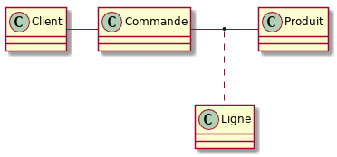

- [Introduction](#orga33f050)
- [Modèle Relationnel](#org481857d)
- [Exemples](#org21d3f03)
  - [Vente en ligne](#orgae5f498)
  - [Bibliothèques virtuelles](#org15943c1)
  - [Organisation de circuits touristiques](#orgfabb8f5)
  - [Planification de repas équilibrés](#org79188b4)
- [Modèle conceptuel de données](#orga0d7bc9)
- [Modèle logique de données](#orgac1a39f)
- [Modèle physique de données](#orgf9a876d)
- [À approfondir](#org62b29e1)
- [En pratique](#org92bb094)
  - [Schémas UML](#orgf5124d1)
  - [Implémentation de SGBDR : SQL](#org1682250)

# Introduction

On a vu que pour l'écriture d'un programme, il fallait se poser en premier lieu la question des entités manipulées et de leur représentation en mémoire dans l'ordinateur, sous forme de types.

On a aussi eu l'occasion de remarquer que le stockage de données sous la forme de fichiers textes était problématique (format et validité des données notamment). Dans le cadre d'un système d'informations (*SI*), on aura aussi des problématiques de performance et de fiabilité, notamment dans le cas d'accès *concurrents*.

La modélisation de données manipulées par un SI est aussi une étape fondamentale préalable au développement.

Elle se décompose, du plus abstrait/général au plus concret/détaillé, du passage des spécifications (représentations mentales) à l'implémentation (représentation dans le SI):

-   spécification / receuil des besoins
-   modèle conceptuel de données
-   modèle logique de données
-   modèle physique de données
-   implémentation de la base de données

On s'intéressera non seulement aux entités, mais aussi à leurs relations. L'approche suivi est donc celle d'une [modęlisation Entités-Relations](https://en.wikipedia.org/wiki/Entity%E2%80%93relationship_model). Des représentations graphiques sont particulièrement adaptées et l'on utilisera des schémas de représentation selon un langage conventionnel. Pour simplifier, on utilisera un sous-ensemble de la représentation UML des diagrammes de classe (utilisé par ailleurs pour documenter les classe d'un projet implémenté en POO) pour représenter les entités et leurs relations.

# Modèle Relationnel

Le [modèle relationnel](https://en.wikipedia.org/wiki/Relational_model) représente les entités et leurs relations sous la forme de tuples. Dans un système de bases de données relationnelles (SGBDR), ces tuples sont les lignes de *tables*, les colonnes correspondent aux attributs de la relation.

Par rapport à une modélisation objet, on a les correspondances suivantes :

-   **table:** classe
-   **colonne:** attribut
-   **ligne:** objet

L'ordre des lignes d'une table n'est pas défini, il n'y a donc pas d'équivalent d'une adresse pouvant servir de référence. Si l'on veut pouvoir distinguer l'identité de deux entités égales, il faudra définir un identifiant dont on garantira l'unicité.

# Exemples

On va s'intéresser à différents cas d'applications :

## Vente en ligne

## Bibliothèques virtuelles

## Organisation de circuits touristiques

## Planification de repas équilibrés

# Modèle conceptuel de données

La première étape, le [modèle conceptuel de données](https://en.wikipedia.org/wiki/Conceptual_schema) consiste à définir tout et seulement ce qui est nécessaire pour exprimer les besoins métiers. Les entités et leurs relations sont seulement (?) nommées. Le nommage est une activité **essentielle** (et difficile).

# Modèle logique de données

On précise le modèle conceptuel :

-   Relations :
    -   Orientation (bidirectionnelle ou non)
    -   Cardinalité
    -   Dépendance ou non sur les durées de vie (agrégation ou composition)
    -   Les relations peuvent être réifiées (avec des attributs). Voir la notion d'[entité d'association](https://en.wikipedia.org/wiki/Associative_entity).
-   Entités :
    1.  attributs
    2.  domaines de définition (plus précis qu'un type)
    3.  identifiants
-   Contraintes d'intégrité :
    -   sur les attributs (cf. domaines de définition)
    -   entre différentes entités

# Modèle physique de données

On prend en compte l'implémentation sous forme de base de données relationnelle et l'on défini les *tables* :

-   [types précis](http://www-db.deis.unibo.it/courses/TW/DOCS/w3schools/sql/sql_datatypes_general.asp.html) (mais cf. infra : dialects)
-   cĺés :
    -   primaires
    -   étrangères
-   [contraintes d'intégrités explicites](https://en.wikipedia.org/wiki/Check_constraint)

# À approfondir

La performance des SGDBR est souvent un aspect critique. Par rapport à ce qui a été abordé, il faudra aussi considérer :

-   [les index](https://use-the-index-luke.com/) qui permettent d'accélérer certaines requêtes en lecture au prix d'un coût en espace de stockage et en temps d'écriture.
-   [la dénormalisation](https://en.wikipedia.org/wiki/Denormalization) qui permet d'accélérer certaines requêtes en lecture (éliminant des jointures) au prix de redondances de données stockée (coût en espace de stockage et problématique de maintient de cohérence en modification)

# En pratique

## Schémas UML

Notation : on utilise un sous-ensemble de la notation des diagrammes de classe en UML. On peut utiliser pour cela n'importe quel logiciel, par exemple un [plugin PlantUML pour Eclipse](http://plantuml.com/fr/eclipse) ou un [plugin pour IntelliJ](https://plugins.jetbrains.com/plugin/7017-plantuml-integration/).

## Implémentation de SGBDR : SQL

[SQL](https://en.wikipedia.org/wiki/SQL) est le langage **standard** des SGDBR. Malheureusement, les différents SGDBR implémentent des **dialectes** plus ou moins complets / compatibles entre eux. Il faudra donc s'intéresser au SGDBR utilisé pour l'implémentation lors de la conception du modèle physique de données. Ce sera aussi l'une des motivations pour utiliser une couche d'abstraction qui automatisera l'utilisation de divers dialectes de SQL à partir de programmes Java au travers d'une interface uniforme.

On peut pratiquer SQL de différentes façons :

-   [console sql en ligne](http://sqlfiddle.com/#!17)

-   [(petite) base de donnée PostgreSQL en ligne gratuite](https://customer.elephantsql.com/instance/create?plan=turtle)

-   [installation locale de PostgreSQL](https://www.postgresql.org/)

La [documentation en ligne](https://www.postgresql.org/docs/9.6/static/index.html) et des [tutoriels](http://www.postgresqltutorial.com/) de qualité sont disponibles pour PostgreSQL.
