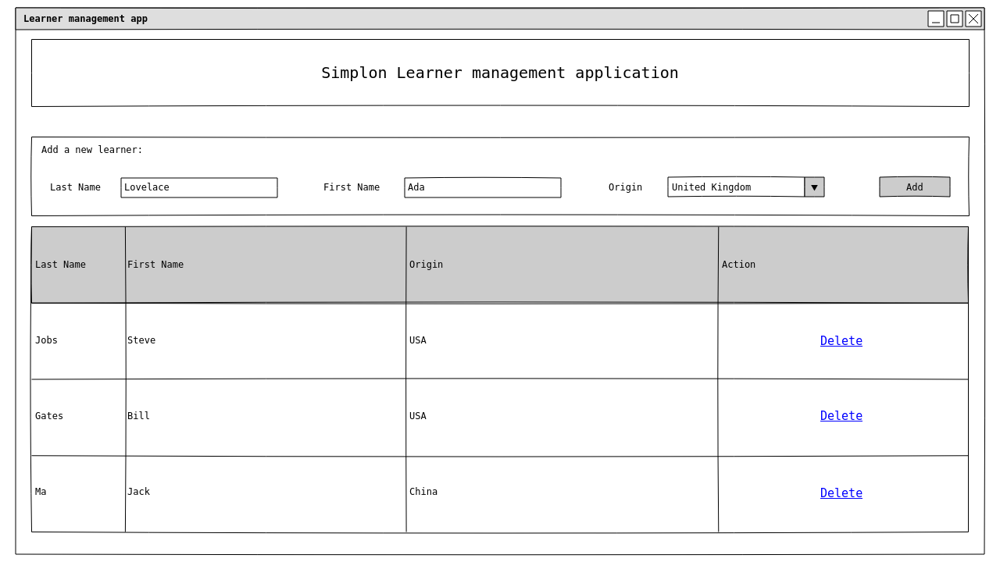

# Exercices HTML & CSS

Réalisation de la documentation d'un projet (Python ou Java) en HTML & CSS

## Etape 1 : On ferme son PC

Avant de se lancer tête baissée dans le code HTML et CSS, il est recommandé de dessiner la structure de vos différentes pages web. Vous pouvez le faire sur papier et/ou en utilisant un outil spécialement conçu pour ça (Balsamiq, Pencil, ...).

Avant de faire une superbe interface, il est préférable de faire des **wireframes**. Il s'agit de dessins très basiques sans mise en forme. Ces dessins permettent de réaliser le **zoning** de vos pages.

Voici un exemple de wireframe pour une application de gestion des apprenants Simplon :

Votre première mission sera de réaliser différents wireframes de la documentation de votre projet.

Votre site devra contenir :

- Un bandeau avec le titre de votre projet (et avec le logo du langage si vou voulez).
- Un menu fait avec des liens permettant de découper la documentation (_Accueil_, _Organisation du code_, _Déploiement_ et _Contact_).
- Une vidéo / ou des images sur la page d'accueil qui montre comment votre proramme fonctionne.
- Des captures d'écrans ou des extraits de code dans la section _Organisation du code_.
- Une liste d'étapes à suivre pour compiler et utiliser votre projet dans la section _Déploiement_.
- Un formulaire de contact pour la section _Contact_.

## Etape 2 : Traduction des wireframes en HTML

Une fois la structure du site détaillée à l'aide de wireframes, traduisez tout ça sous forme de pages HTML.

## Etape 3 : Tout ça avec du style

Une fois que vous avez créé votre structure en HTML, vous pouvez mettre en forme pour rendre tout ça plus sympa.

Quelques exigences :

- Tous les titres doivent être en couleurs (autre que noir)
- Vous devez utiliser [Flexbox](https://developer.mozilla.org/fr/docs/Web/CSS/CSS_Flexible_Box_Layout/Concepts_de_base_flexbox)
- Vous devez choisir une mise en forme spécifique pour les mots qui représentent du code type `github markdown`
- Le style doit être dans un fichier CSS séparé (pas directement dans le fichier HTML).

_En bonus_ : Utilisez la librairie [highlightjs](https://highlightjs.org/) pour mettre en forme les passages de code.
