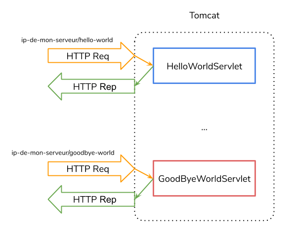

# Le framework Spring boot

Pour développer nos premières API REST nous allons utiliser [Spring boot](https://spring.io/projects/spring-boot) qui est un framework Java (qui peut s'utiliser aussi avec [Kotlin](https://kotlinlang.org/) ou [Groovy](http://groovy-lang.org/)).

## Pourquoi un framework

Pourquoi utiliser un framework ? Parce qu'en tant que développeur•euse, nous avons souvent tous les **mêmes besoins**. Le développement d'API REST en Java est un exemple très répandu. De fait, certains développeur•euse•s / organisations ont réalisé qu'il pouvait être plus rapide de développer si cela se faisait dans un **cadre imposé** apportant des réponses aux problématiques d'architecture du code et avec des **librairies standard** pour les besoins récurrents (accès aux bases de données, utilisation d'ORM, tests unitaires, ...).

Ce qui est important en développement c'est d'apporter de la **valeur aujoutée**. Et si l'on peut simplement se concentrer sur la logique métier de notre application en suivant des grands principes d'architecture largement partagés et des librairies professionnelles, alors c'est tout bénef.

## Qu'apporte Spring boot

Spring boot apporte un cadre de développement et un grand nombre de librairies. Nous n'utiliserons qu'une petite partie de la puissance de Spring boot.

### L'inversion de contrôle et l'injection de dépendances

Un des grands avantages de Spring boot est l'injection de dépendance. Ce qui va changer par rapport à la façon traditionnelle de programmer, c'est que nous n'allons plus gérer la création de certains objets dont notre code dépend (excepté les classes de données).

Prenons l'exemple suivant (cas tradionnel) ou ma classe `CsvReader` doit faire utiliser des DAO pour sauvegarder des données en base de données :

```java
public class CsvReader {
  private ZipCodeDAO zDao;
  private CityDAO cDao;

  public CsvReader() {
      this.zDao = new ZipCodeDAO();
      this.cDao = new CityDAO();
  }
}
```

Ici, c'est moi en tant que programmeur•euse qui est responsable de **l'instanciation** des deux attributs DAO.

Dans le cas d'une injection de dépendance, on va déléguer cette responsabilité au framework en utilisant ce type de code :

```java
public class CsvReader {
  private ZipCodeDAO zDao;
  private CityDAO cDao;

  public CsvReader(ZipCodeDAO zDao, CityDAO cDao) {
      this.zDao = zDao;
      this.cDao = cDao;
  }
}
```

Pourquoi allons nous procéder de cette façon ? Parce que cela permet :

- De changer facilement entre différentes implémentations. Je peux utiliser des interfaces pour mes services et laisser la responsabilité au framework de trouver la bonne implémentation de cette inrface en fonction, par exemple, de la configuration de mon application.
- De simplifier les tests. Comme nous le verrons plus tard, plus une classe est liée à d'autre, plus son fonctionnement peut-être difficile à tester. Dans le cas d'injection de dépendances, on peut _mocker_ (simuler) plus facilement le fonctionnement des classes dont on dépend.

Aujourd'hui, c'est très facile de le faire avec le framework Spring boot. Mais on aurait tout à fait pu le développer nous même. Avec par exemple l'utilisation d'un pattern `Factory`. Cela est quand même un peu moins pratique, parce qu'il faut le gérer nous même.

### Web

Ok, l'injection de dépendance c'est pas mal, mais au départ on parle de Spring boot pour créer une API REST, pas pour gérer les dépendances dans le code ! Et le principe d'une API REST c'est de pouvoir **répondre** à des **requêtes HTTP** qui arrivent sur notre serveur.

#### Servlet et conteneur de Servlet

Il faut être conscient que la gestion de réponse à des appels HTTP en Java se faisait bien avant l'apparition du framework Spring. Et c'était possible grâce aux **Servlets**. Un (ou une) Servlet est une classe Java qui définit le comportement à avoir en fonction d'un certain appel réseau (et notamment HTTP).

Prenons l'exemple du fameux HelloWorld :

```java
public class HelloWorldServlet extends HttpServlet {

  private String message;

  public void init() throws ServletException {
    message = "Salut la promo !";
  }

  // On gère la méthode HTTP GET
  public void doGet(HttpServletRequest request, HttpServletResponse response)
    throws ServletException, IOException {

    // On indique que l'on renvoie du JSON
    response.setContentType("application/json");

    // Et on le renvoie pour de vrai !
    PrintWriter out = response.getWriter();
    out.println("{ \"message\": \"" + message + "\"}");
  }

  public void destroy() {
    // Rien à faire dans ce cas.
  }
}
```

Ensuite il suffit de configurer notre application Java pour lui dire que ce `HelloWorldServlet` doit être **mappé** à une URL de notre serveur (par exemple : `http://ip-de-mon-serveur/hello-world`). Lorsque mon serveur reçoit une requête HTTP GET à cette URL, alors il exécute le code défini ci-dessus. Magique, non ?

_Je n'explique pas la partie configuration de l'application, et c'est volontaire, car nous ne l'utiliserons pas de la même manière avec Spring boot._

Enfin pour que ce code fonctionne, il faut que notre **Servlet** tourne dans un **conteneur de Servlet**. En effet, un programme classique Java n'est pas équipé pour répondre aux appels HTTP et dispatcher les requêtes en fonction des mappings. On utilisera donc un serveur web Java permettant la gestion des **Servlets** comme [Tomcat](https://tomcat.apache.org/).

Si l'on avait plusieurs Servlets :



#### Comment ça marche chez Spring

Spring est basé sur le même principe et utilise un Servlet bien particulier : le `DispatcherServlet` qui se charge de récupérer les requêtes entrantes dans notre serveur et de les dispatcher (sans surprise ^^) vers le code que l'on va rédiger pour gérer nos différents besoins. Plus de détails : [la documentation officielle de Spring](https://docs.spring.io/spring/docs/current/spring-framework-reference/web.html#spring-web). Nous verrons les détails de l'utilisation dans les prochaines parties.

### JPA

Spring boot nous permet d'utilier JPA avec Hibernate et ajoute de nombreuses fonctionnalités permettant encore d'accélerer le développement de nos applications comme avec les [JpaRepository](https://docs.spring.io/spring-data/jpa/docs/current/api/org/springframework/data/jpa/repository/JpaRepository.html).

### Security

C'est souvent un besoin primordial lorsque l'on développe une API REST que de sécuriser son API. Il faut dans ce cas pouvoir **authentifier** les utilisateurs pour s'assurer que l'on connaît les personnes qui vont utiliser notre API et leur donner des **autorisations** (ou permissions). Spring permet de cadrer cet aspect et nous le verrons en détails dans un cours particulier sur ce sujet.

### Et tout le reste

Spring propose beaucoup d'autres modules et permet par exemple une intégration facile avec les architectures Cloud, le développment web reactive, ... Bref vous aurez l'occasion de découvrir ça plus en détails dans le futur ;-).

## Spring boot en pratique

En pratique, Spring boot utilise [Maven](https://maven.apache.org/) ou [Gradle](https://gradle.org/) pour la description du projet. Cela permet de gérer les dépendances des librairies (à ne pas confondre avec l'injection de dépendance dans le code) et aussi le cycle de vie du développement du projet (compilation, mise en service, ...). Nous choisirons Maven.

Pour créer un projet Sprinb boot, deux solutions :

- L'utilisation de la plateforme [Spring Initializr](https://start.spring.io/).
- L'utilisation d'un IDE comme Eclipse ou IntelliJ avec leur assistant de création de projet Spring boot.

Dans les deux cas, cela permet de télécharger un projet Spring boot avec un pom.xml déjà pré-rempli et une arborescence d'application.

### Configuration

En fonction des modules que nous aurons choisis, nous aurons à configurer certains paramètres (comme l'adresse de connexion à la base de données, ...). Nous pourrons utiliser le fichier `application.properties` pour ça.

### Controllers

L'interface de notre API REST avec le monde extérieur se fera par l'intermédiaire des `Controllers`. Ce sont les classes que nous définirons pour gérer les requêtes HTTP et produire les réponses.

Voici un exemple court mais riche en contenu :

```java
@RestController
@RequestMapping("/api/hello-world")
public class HelloWorldController {

    @GetMapping
    public ResponseEntity<Message> sayHello() {
        return ResponseEntity.ok(new Message("Salut la promo !"));
    }

}
```

Plein de nouveaux concepts dans ce si petit bout de code :

- L'annotation `@RestController` qui fait deux choses en une :
  - définir que notre classe est un **Controller** et que le framework devra donc considérer ce code comme une interface vers le monde extérieur et la charger au lancement de l'application.
  - définir que le retour de nos méthodes de **Controllers** devront être sérialisés en JSON.
- L'annotation `@RequestMapping("/api/hello-world")` qui définit l'URL dont sera responsable le **Controller** (ici : `/api/hello-world`). Toutes les requêtes HTTP arrivant à mon serveur avec l'URL `http://ip-de-mon-serveur/api/hello-world` seront traîtées par cette classe.
- L'annotation `@GetMapping` devant la méthode `sayHello()` qui indique que les appels GET sur `http://ip-de-mon-serveur/api/hello-world` seront traîtées par la méthode `sayHello()`.
- La classe `ResponseEntity` comme type de retour de la méthode `sayHello()`. C'est une classe utilitaire permettant de renvoyer facilement des réponses au bon format.

On peut évidemment utiliser d'autres annotations comme `@PostMapping`, `@PutMapping`, `@DeleteMapping`, ... pour gérer les autres types d'appel HTTP.

Afin de garder un code propre, il faut éviter de coder la logique métier de notre application dans les controllers. Il s'agit vraiment d'interfaces avec le monde extérieur. Les méthodes de ces classes sont responsables de récupérer les requêtes d'y répondre, la logique métier doit se trouver ailleurs. Et souvent c'est l'occasion de développer des `Service`.

### Un serveur web Java embarqué

Lorsque l'on développe une API REST avec Spring boot un serveur web Java Tomcat est directement packagé avec notre API. Cela permet de lancer simplement l'application développée avec un JRE Java. Pas besoin d'installer un serveur Tomcat, magique non ?
