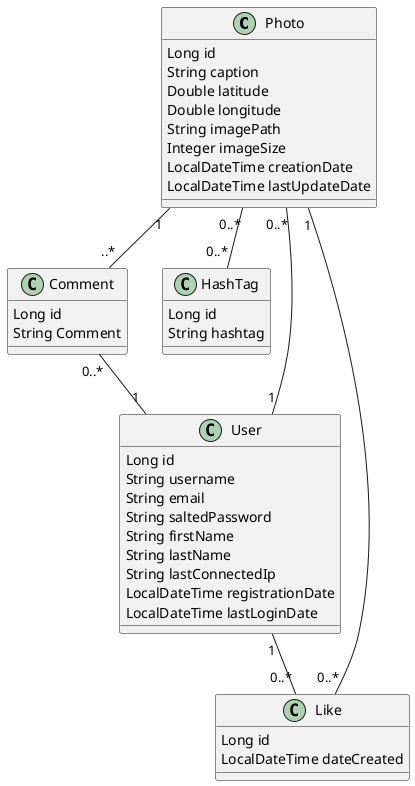

# Exercices base de données relationnelle

## Etape 1 : Setup de la base

### Installation d'une base postgresql

- Pour installer postgresql sur un poste Ubuntu : `sudo apt install postgresql`.
- Pour installer postgresql sur un poste Windows :
  - [Téléchargement de la base](https://www.enterprisedb.com/downloads/postgres-postgresql-downloads)
  - [Procédure d'installation](https://www.enterprisedb.com/edb-docs/d/postgresql/installation-getting-started/installation-guide-installers/12/PostgreSQL_Installation_Guide.1.07.html)

### Récupération de l'environnement de dev

[DataGrip](https://www.jetbrains.com/datagrip/)

### Création d'un rôle

On va créer un rôle pour utiliser avec la base de données avec DataGrip.

`sudo -u postgres createuser --interactive -P`

- `name of role` => db-user
- `password` => _up to you_
- `superuser` => no
- `create database` => yes
- `create new roles` => no

Une fois ceci fait, on peut utiliser DataGrip pour manipuler nos bases, créer des tables, ...

### Création d'une base

## Etape 2 : Création d'une base à partir d'un modèle de données

Votre mission si vous l'acceptez : recréer la base de données d'Instagram !

On appellera cette base : `instagram`.

#nofilter

### Création de la base

A partir du diagramme de classe ci-dessous : créer le script SQL qui permettra de créer la structure de la base de données.

### Validation de la base

Essayez :

- d'insérer des données dans la table `photos` avant la table `users` (assurez vous que ça ne passe pas)
- d'insérer des `users` puis des `photos`
- d'insérer des `hashtags`
- de faire des liens entre des `photos` et de `hashtags`
- d'insérer des `comments` liés à des `photos`
- d'insérer des `likes` liés à des `photos` et des `users`
- de supprimer un `user` qui possède plusieurs `photos` et assurez vous que :
  - Les `photos` associées au `user` sont supprimées
  - Les `comments` associés aux `users` sont supprimées
  - Les `likes` associés aux `users` sont supprimées
  - Les `comments` associés aux `photos` associées aux `users` sont supprimées
  - Les `likes` associés aux `photos` associées aux `users` sont supprimées

## Etape 3 : Requêtage d'une base

