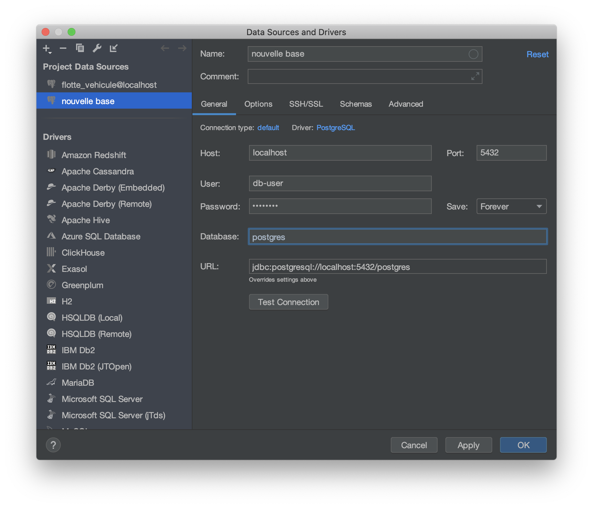

# Exercices base de données relationnelle

## Etape 1 : Setup de la base

### Installation d'une base postgresql

- Pour installer postgresql sur un poste Ubuntu : `sudo apt install postgresql`.
- Pour installer postgresql sur un poste Windows :
  - [Téléchargement de la base](https://www.enterprisedb.com/downloads/postgres-postgresql-downloads)
  - [Procédure d'installation](https://www.enterprisedb.com/edb-docs/d/postgresql/installation-getting-started/installation-guide-installers/12/PostgreSQL_Installation_Guide.1.07.html)

### Récupération de l'environnement de dev

[DataGrip](https://www.jetbrains.com/datagrip/)

### Création d'un rôle

On va créer un rôle pour utiliser avec la base de données avec DataGrip.

`sudo -u postgres createuser --interactive -P`

- `name of role` => db-user
- `password` => _up to you_
- `superuser` => no
- `create database` => yes
- `create new roles` => no

Une fois ceci fait, on peut utiliser DataGrip pour manipuler nos bases, créer des tables, ...

### Création d'une base

## Etape 2 : Création d'une base à partir d'un modèle de données

Votre mission si vous l'acceptez : recréer la base de données d'Instagram !

On appellera cette base : `instagram`.

#nofilter

### Création de la base

A partir du diagramme de classe ci-dessous : créer le script SQL qui permettra de créer la structure de la base de données.

### Validation de la base

Essayez :

- d'insérer des données dans la table `photos` avant la table `users` (assurez vous que ça ne passe pas)
- d'insérer des `users` puis des `photos`
- d'insérer des `hashtags`
- de faire des liens entre des `photos` et de `hashtags`
- d'insérer des `comments` liés à des `photos`
- d'insérer des `likes` liés à des `photos` et des `users`
- de supprimer un `user` qui possède plusieurs `photos` et assurez vous que :
  - les `photos` associées au `user` sont supprimées
  - les `comments` associés aux `users` sont supprimées
  - les `likes` associés aux `users` sont supprimées
  - les `comments` associés aux `photos` associées aux `users` sont supprimées
  - les `likes` associés aux `photos` associées aux `users` sont supprimées

## Etape 3 : Requêtage d'une base

Vous allez devoir créer et remplir une nouvelle base de données : `simplon_airlines` grâce à ce script : [DDL Simplon Airlines](../ressource/bdd/simplon_airline.sql).

Ensuite vous aurez pour mission de réaliser les requêtes suivantes :

### 1. Affichage des marques des avions

Résultat attendu _(2 lignes)_ :

| name |
| :--- |
| Airbus |
| Boeing |

### 2. Affichage des modèles d'avion Boeing

Résultat attendu _(14 lignes)_ :

| name |
| :--- |
| 247 |
| 307 |
| 314 |
| 377 |
| 707 |
| 717 |
| 720 |
| 727 |
| 737 |
| 747 |
| 757 |
| 767 |
| 777 |
| 787 |

### 3. Affichage de toutes les villes et leurs pays

Résultat attendu _(400 lignes)_ :

| pays | ville |
| :--- | :--- |
| Albania | Bërxull |
| Albania | Libofshë |
| Albania | Poroçan |
| Angola | Lucapa |
| China | Anjia |
| ... | ... |
| Vietnam | Tân Hiệp |
| Vietnam | Thị Trấn Na Hang |
| Vietnam | Thị Trấn Thọ Xuân |
| Vietnam | Tiền Hải |

### 4. Affichage des avions AIRBUS ayant plus de 300 places triés par nb de places décroissant

Résultat attendu _(63 lignes)_ :

| registration | seats_nb | name | name |
| :--- | :--- | :--- | :--- |
| FHN | 594 | Airbus | A340 |
| GBG | 593 | Airbus | A340 |
| YFX | 592 | Airbus | A318 |
| ... | ... | ... | ... |
| IXP | 315 | Airbus | Beluga |
| RZD | 312 | Airbus | A319 |
| QHI | 304 | Airbus | A321 |
| GXE | 302 | Airbus | A380 |

### 5. Affichage des vols intérieurs (même pays)

Résultat attendu _(41 lignes)_ :

| name | name | name |
| :--- | :--- | :--- |
| China | Dongfanghong | Dingbao |
| China | Shuigou | Hongqiao |
| China | Luntai | Xiangshui |
| ... | ... | ... | ... |
| Sweden | Solna | Tyresö |
| China | Xiongchi | Chengjiao |
| China | Liulin | Jingzhou |
| China | Haikoudajie | Longxing |
| Philippines | Himaya | Villa Aglipay |

### 6. Affichage des vols intérieurs plus longs que 5h triés par durée décroissante

Résultat attendu _(17 lignes)_ :

| name | name | name | hour_duration |
| :--- | :--- | :--- | :--- |
| China | Oroin Xibe | Daxi | 9 |
| Philippines | Himaya | Villa Aglipay | 9 |
| China | Dongfanghong | Chengbei | 9 |
| China | Daijiaba | Dabachang | 9 |
| China | Shuigou | Hongqiao | 8 |
| China | Liulin | Yashao | 8 |
| China | Changliang | Lubao | 8 |
| China | Tuanchengshan | Ha’erlong | 7 |
| China | Yushan | Shuigou | 6 |
| China | Tianyu | Zhujiachang | 6 |
| China | Haikoudajie | Longxing | 6 |
| Poland | Witkowo | Leśnica | 6 |
| Japan | Kashima-shi | Menuma | 6 |
| China | Xiaohebian | Qiaotou | 6 |
| China | Lubao | Dabachang | 5 |
| Sweden | Solna | Tyresö | 5 |
| China | Rangxi | Chuoyuan | 5 |

### 7. Afficher les 5 vols ayant le plus de personnel navigant

Résultat attendu _(5 lignes)_ :

| from_city | to_city | employee_count |
| :--- | :--- | :--- |
| Colorado Springs | Kingersheim | 7 |
| Yūki | Yushan | 6 |
| Fontenay-sous-Bois | Rochester | 6 |
| Bjuv | Edosaki | 5 |
| Yujiawu | Nîmes | 5 |

### 8. Afficher les personnes travaillant moins d'une heure dans la compagnie

Résultat attendu _(32 lignes)_ :

| first_name | last_name | hour_work |
| :--- | :--- | :--- |
| Cordie | Vidgeon | 0.02 |
| Auguste | Lohoar | 0.06 |
| Corly | Clunie | 0.06 |
| Kellen | VanBrugh | 0.17 |
| Sheila-kathryn | Kermott | 0.17 |
| Niels | Mochar | 0.17 |
| Erda | Townes | 0.17 |
| Simonette | Trillow | 0.19 |
| Annemarie | Takle | 0.23 |
| Georgetta | O'Shirine | 0.24 |
| Jonathon | Michal | 0.38 |
| Alexandrina | Vuittet | 0.41 |
| Leela | Nellis | 0.41 |
| Richy | Molineaux | 0.42 |
| Derick | Durdle | 0.47 |
| Hilliard | Crosfeld | 0.47 |
| Hodge | Griffe | 0.48 |
| Berty | Jorin | 0.48 |
| Correy | Seldner | 0.55 |
| Bartolemo | Ianiello | 0.64 |
| Cristionna | Scambler | 0.7 |
| Orella | Kenrack | 0.71 |
| Eulalie | Brussell | 0.71 |
| Vernen | Jenne | 0.71 |
| Idalia | Bauer | 0.76 |
| Loretta | Ely | 0.76 |
| Celisse | Bertolaccini | 0.83 |
| Evelin | Cunradi | 0.86 |
| Chariot | Draysay | 0.89 |
| Karyn | Pomfrey | 0.9 |
| Felisha | Ronnay | 0.98 |
| Clerkclaude | Collinson | 0.98 |

### 9. Afficher les durées des vols intérieur en utilisant intersect

Résultat attendu _(41 lignes)_ :

| flight_duration_hour | country_name |
| :--- | :--- |
| 9.92 | China |
| 9.76 | Philippines |
| 9.52 | China |
| 9.13 | China |
| 8.16 | China |
| 8.15 | China |
| 8.05 | China |
| 7.34 | China |
| 6.97 | China |
| 6.68 | China |
| 6.29 | China |
| 6.27 | Poland |
| 6.24 | Japan |
| 6.2 | China |
| 5.83 | China |
| 5.52 | Sweden |
| 5.12 | China |
| 4.77 | China |
| 4.28 | China |
| 4.24 | China |
| 4.06 | China |
| 3.58 | China |
| 3.4 | China |
| 3.28 | China |
| 3.18 | China |
| 2.79 | China |
| 2.72 | China |
| 2.55 | China |
| 2.52 | China |
| 2.32 | Philippines |
| 2.05 | Sweden |
| 2.01 | China |
| 1.86 | China |
| 1.86 | United States |
| 1.1 | China |
| 0.86 | China |
| 0.57 | China |
| 0.47 | China |
| 0.42 | China |
| 0.23 | China |
| 0.19 | Poland |
