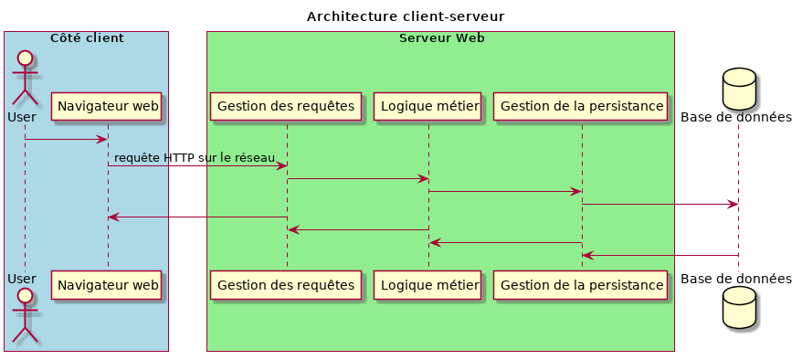
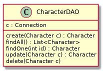

- [Contexte](#org5838274)
- [Un CRUD Star Wars](#orge620c8f)
- [Spécifications](#orgcce4ff4)
- [Niveaux d'implémentation](#org469c021)

# Contexte

La base d'un système informatique de gestion de données est de permettre à minima les opérations suivantes :

-   **création:** on doit pouvoir ajouter de nouvelles entités
-   **lecture:** on doit pouvoir :
    -   lister les différentes instance d'un même type
    -   liste toutes les informations d'une instance en particulier
-   **éditer:** on doit pouvoir modifier les informations d'une entité
-   **supprimer:** on doit pouvoir supprimer une entité

En anglais, ces opérations (****Create****, ****Read****, ****Update****, ****Delete****) on donné l'acronyme ****CRUD****. À terme, on verra comment implémenter un CRUD web avec les aspects client-serveur, ce qui servira de base avant d'implémenter en sus les fonctionnalités métier spécifiques à chaque application. Dans un premier temps, on va se concentrer sur la partie "Gestion de la persistance" du schéma ci-dessous :

# Un CRUD Star Wars

En réutilisant les données du brief [May the Database be with you](https://simplonline.co/briefs/detail/xL4XMmevPA2pZH8gT), on va implémenter un CRUD en Java. Les entités sont donc :

-   Character
-   Planet
-   Specie
-   Starship
-   Vehicule

Pour chaque entités, vous créerez deux classes Java correspondantes. Par exemple :

-   **Character:** qui contient les informations associées à un personnage.
-   **CharacterDAO:** DAO pour *Data Acces Object* qui permettra de gérer la persistance des objets de la classe `Character` :

# Spécifications

Écrire un programme qui :

1.  Propose de choisir parmi les différents types d'entités
2.  Pour le type d'entités choisi :
    
    1.  Affiche toutes les entités de ce type contenues dans la base de données
    2.  Propose de :
        1.  revenir au menu précédent
        2.  modifier une entité
        3.  supprimer une entité
    
    Dans les deux dernier cas, le programme propose ensuite de saisir l'identifiant (ou le numéro dans la liste affichée en 1.), et dans le cas 2. il demande ensuite de saisir toutes les informations caractérisant l'entité (sauf l'identifiant, évidemment).

# Niveaux d'implémentation

1.  Implémenter les fonctionnalités pour la gestion CRUD d'un seul type d'entités
2.  Implémenter les DAO pour toutes les entités
3.  Implémenter les fonctionnalités CRUD pour plus d'entités

Pour éviter la duplication de code, on peut essayer d'utiliser l'héritage.
