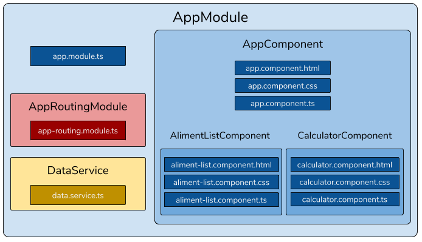

# Développer une SPA avec Angular

## Mais d'abord c'est quoi une SPA

Une SPA est une Single Page Application. Il s'agit d'avoir une seule page où les données et les vues sont rechargées par JavaScript au lieu de faire des appels au serveur pour recharger les pages. On a donc les mécanismes suivants :

- Chargement des données de l'application via une API (souvent REST) de manière asynchrone (c'est ce qui est exécuté côté serveur)
- Modification du DOM (Domain Object Model) lorsque l'on souhaite modifier la vue (cela se passe côté client)


### Les avantages d'une SPA

- Notre serveur est moins sollicité
- Les utilisateurs ont l'impression d'utiliser une application (client lourd)
- Tout notre contenu est chargé en une seule fois
- Bonne fluidité une fois le contenu chargé

### Les inconvénients d'une SPA

- Le temps de chargement de notre site peut être plus long au démarrage
- Une grande partie de notre code est exposée au client

## Angular

Angular est un framework permettant de développer des SPA (qu'elles soient prévues pour le web, pour mobile ou pour client lourd).

**Pourquoi un framework ?** Parce que c'est logique ! Pour rappel, un bref historique du développement web :

- Au départ on fait du **HTML** pour afficher des documents (résultats de recherche scientifique) à partir de 1989
- On ajoute du **CSS** pour rendre les pages plus _charmantes_
- Puis **JavaScript** arrive en 1995 pour ajouter du dynamisme
- Dans les années 2000 les premières librairies Javascript comme **jQuery** apparaissent pour faciliter l'écriture des scripts côté client. Ces librairies permettent aux développeurs de raccourcir leur code et de ne pas réinventer la roue pour des fonctionnalités fréquemment utilisées comme les appels Ajax ou la manipulation du DOM.
- Aujourd'hui on utilise des frameworks (ou cadriciels pour les académiciens) comme **Angular** pour construire des Single Page Applications. Ces frameworks permettent de faire les mêmes choses qu'avec des librairies comme jQuery et rajoutent un cadre de développement. Cela permet de construire des applications modulaires rapidement et proprement.

Angular est développé par Google depuis Septembre 2016. Il s'agit d'une réécriture complète du framework AngularJS. Contrairement à ce dernier il est écrit en TypeScript (et non en JavaScript). Pour plus d'informations :

- [Angular.io](https://angular.io)
- [La page Wikipédia d'Angular](https://fr.wikipedia.org/wiki/Angular)

## L'environnement de développement

- **Node.js** : Angular a besoin de Node.js afin de récupérer les différents packages dont il est constitué ainsi que pour fournir un serveur local en mode développement (notamment afin de faire du rechargement à chaud lorsqu'on modifie sont code).
- **npm** : Angular utilise npm pour gérer les packages dont il est constitué. C'est un peu comparable à Maven pour Java.
- **Angular CLI** : Angular propose d'utiliser Angular CLI afin de faciliter le développement. Cela permet de créer des composants, de compiler l'application, de maintenir l'application, ...
- **Webpack** : Outil magique qui va agréger tous nos fichiers HTML, TS et CSS en seulement un fichier HTML, un fichier CSS et 5 fichiers JS.

## De quoi se compose une application Angular

### Les modules

Les modules définissent les **blocs fonctionnels** d'une application. On peut choisir de séparer son application en différents modules. Chaque module est donc une **unité fonctionnelle** de l'application (un module de paiement par exemple). Ces modules sont eux mêmes découpés en vues et services.

Les modules (au sens Angular) ne doivent **pas être confondus** avec les modules JavaScript. Il s'agit de deux concepts **indépendants** et **complémentaires**. De manière très simplifiée, un module JavaScript est un bout de code d'un fichier qu'on exporte avec le mot clé `export` (qu'on rend disponible pour d'autres fichiers) et qu'on importe avec le mot clé `import` dans un autre fichier. Un module Angular est un ensemble de fichiers qui composent une unité fonctionnelle de notre application.

Une application aura toujours un **module racine** (_root module_ in English). C'est en général le fichier `AppModule.ts`. C'est ce module qui _amorce_ l'application (_bootstrap_ in English) avec le **composant racine** (_root component_ in English). Ce module peut faire appel à d'autres modules si besoin. Les autres modules peuvent être créés spécialement pour l'application (nos blocs fonctionnels) ou être importés d'autres librairies.

### Les vues

Les vues sont les blocs de base qui composent notre application. C'est dans les vues que l'on va écrire du HTML, du CSS et du TypeScript.

Les vues sont très souvent composées de **3 fichiers** (parfois un 4ème pour les tests) :

- Un fichier HTML qui sera le **template** de notre vue <=> c'est la **structure** de l'interface graphique
- Un fichier CSS (ou SCSS) sera le **style** de notre vue <=> c'est la **mise en forme** de l'interface graphique
- Un fichier TS appelé composant qui implémentera la **logique** de notre vue <=> c'est la **logique** de l'interface graphique

Notre application aura une **vue racine** qui sera déclarée dans notre **module racine**. Cette vue pourra ensuite inclure d'autres vues définies dans notre application.

Lorsqu'on développe sa première application Angular, on crée souvent plusieurs vues que l'on va déclarer dans son module racine. Nos vues sont donc toutes définies dans notre module racine. Lorsque notre application grandit, on peut choisir de regrouper les vues d'un même bloc fonctionnel dans différents modules. On peut ainsi importer seulement les modules dans son module racine.

### Les services

Les services mettent à disposition des fonctions qui peuvent être **partagées** par différents composants. Il s'agit ici de permettent la **modularité** de son application en développant toutes les fonctions qui ne sont pas liées à une vue en particulier.

Typiquement lorsqu'on développe une application web avec Angular on va développer l'interface graphique avec Angular et cette interface s'appuiera sur une API REST pour récupérer ou sauvegarder des données. On va très souvent faire nos appels à l'API dans des services.

Les services sont ensuite utilisables facilement dans les composants grâce à l'injection de dépendances.

### Un exemple

Pendant cette session nous allons réaliser deux mini projets :

- Une application calcul de charge glycémique
- Une application pour jouer au jeu timeline

Voici le schéma représentant l'architecture de l'application de calcul de charge glycémique.



Et deux captures d'écran présentant l'application :


Vous ferez celui de l'application Timeline ;-).

## La particularité d'Angular : TypeScript

### C'est quoi TypeScript

TypeScript est un sur-ensemble de JavaScript. On peut donc écrire du code JavaScript dans un fichier TypeScript. TypeScript apporte aussi son lot de fonctionnalités supplémentaires. Un fichier TypeScript doit donc être **transpilé** en JavaScript pour qu'il soit exécutable par un moteur d'exécution JavaScript (le navigateur Web, Node, ...).

### Les avantages

#### Le typage statique

Lorsqu'on code en TypeScript, on _peut_ (ce n'est pas obligatoire) choisir le type d'une variable (contrairement au JavaScript ou le typage des variables est dynamique). Cela permet de sécuriser son code en repérant des erreurs à la compilation (ou transpilation).

On peut donc écrire en **TypeScript** :

```typescript
let isAngularGreat: boolean = true;

// Ce qui veut dire que je ne peux pas faire
isAngularGreat = "C'est pas faux"; // ==> Erreur à la compilation
```

Alors qu'en **JavaScript** on peut écrire :

```javascript
let isAngularGreat = true;
isAngularGreat = "C'est pas faux";
```

On peut aussi typer ses fonctions en **TypeScript** :

```typescript
function isAngularGreat(): boolean {
  return true;
}
```

**TypeScript** propose les mêmes types primitifs que JavaScript :

```typescript
// boolean
let isAngularGreat: boolean = true;

// number
let angularMajorVersion: number = 7;

// string
let angularFullVersion: string = '7.1.4';

// array
let angularMajorVersion: number[] = [2, 4, 5, 6, 7];
let angularVersions: Array<string> = ['6.0.0', '6.1.2', '7.0.0', '7.0.1', '7.1.4'];

```

#### Les classes

En **JavaScript (ES2015)** on peut utiliser :

```javascript
class Framework {
  // attributs
  name;
  language;
  version;

  // méthodes
  ...
}
```

En **TypeScript** on se rapproche du Java :

```typescript
class Framework {
  // attributs
  private name: string;
  private language: string;
  private version: string;

  // méthodes
  ...
}
```

En **TypeScript** on peut d'ailleurs déclarer des **getters/setters** comme en C# :

```typescript
class Framework {
  // attribut
  private _version: string;

  // getter
  get version(): string {
    return 'V_' + _version;
  }

  // setter
  set version() {
    this.version = version;
  }
}
```

Pour plus d'informations :

- [Le site de TypeScript](http://www.typescriptlang.org)
- [TypeScript deep dive](https://basarat.gitbooks.io/typescript/)
