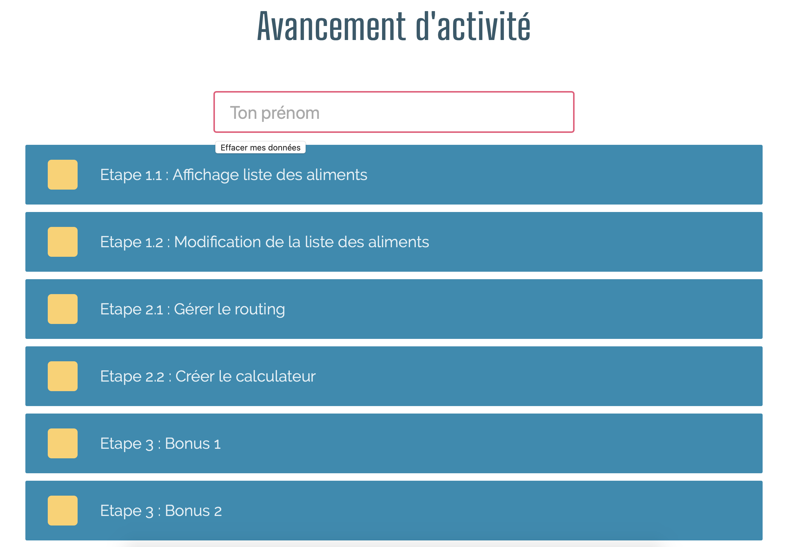

# Angular challenge

## Contexte

Votre formateur :nerd: a besoin d'aide pour finaliser son application de suivi de la promo. Il a besoin de vous pour créer une page (la plus ergonomique possible bien entendu) pour suivre l'avancement de la promo sur une activité (exerice ou mini projet).

Il a déja prévu une page pour que chaque apprenant puisse faire le reporting de son avancement simplement :



Les données sont envoyées à une API REST que l'on pourra ensuite réutiliser pour afficher l'avancement global de la promotion.

## Votre mission

Vous répartir par groupe de 5 et mobiliser toute votre créativité pour réaliser une page permettant de suivre l'avancement de toute la promotion en un coup d'oeil.

Pour cela vous devez créer une application Angular avec une seule page permettant d'afficher l'avancement des apprenants. Pas besoin de se connecter à l'API, vous utiliserez des données de test :

Un tableau de `Learner` :

```typescript
learners = [
  {
    name: 'Hanifa',
    steps: [
      {name: 'Etape 1', checked: true},
      {name: 'Etape 2', checked: true}
    ]
  },
  {
    name: 'Bernard',
    steps: [
      {name: 'Etape 1', checked: true},
      {name: 'Etape 2', checked: false}
    ]
  },
  {
    name: 'Jules',
    steps: [
      {name: 'Etape 1', checked: false},
      {name: 'Etape 2', checked: false}
    ]
  },
]
```
