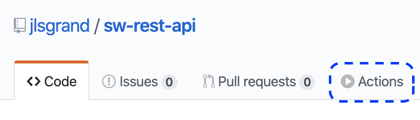
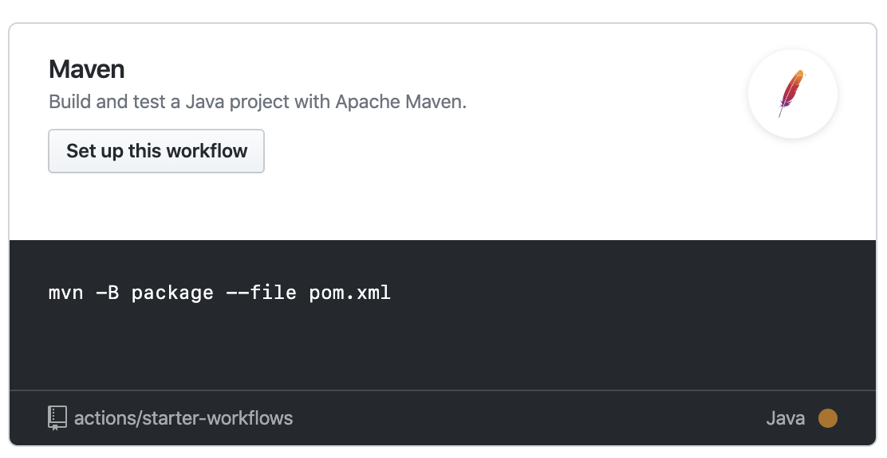
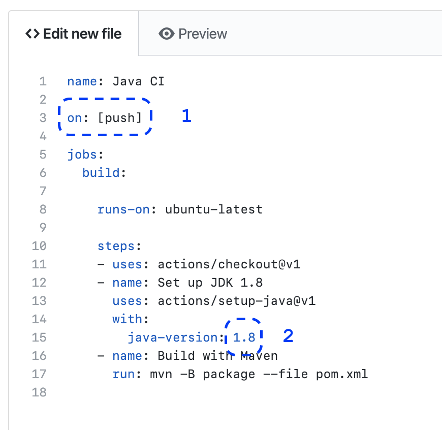
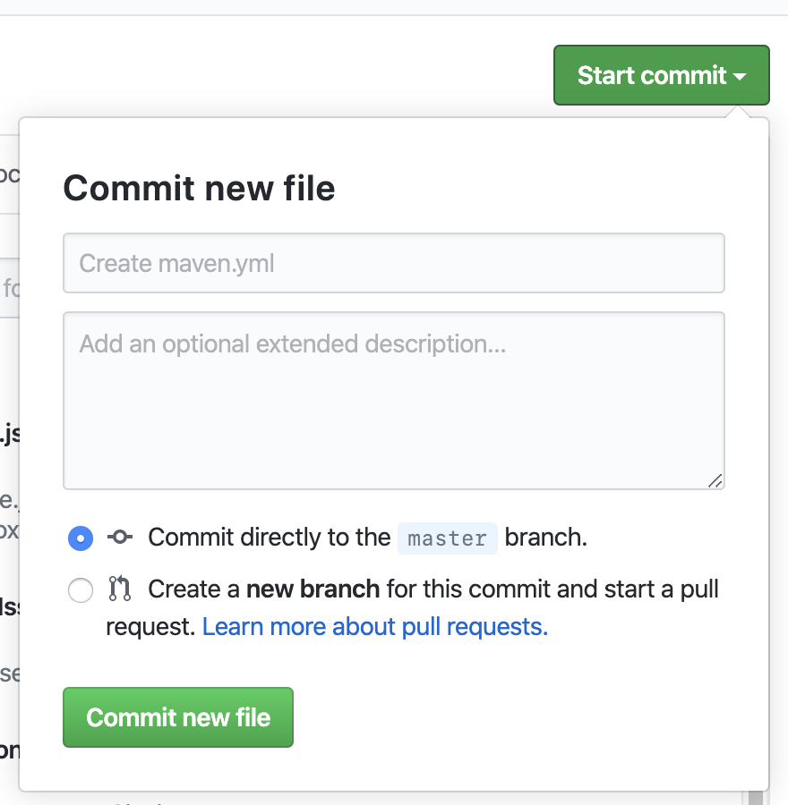
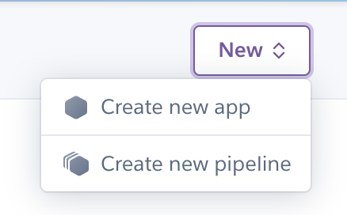
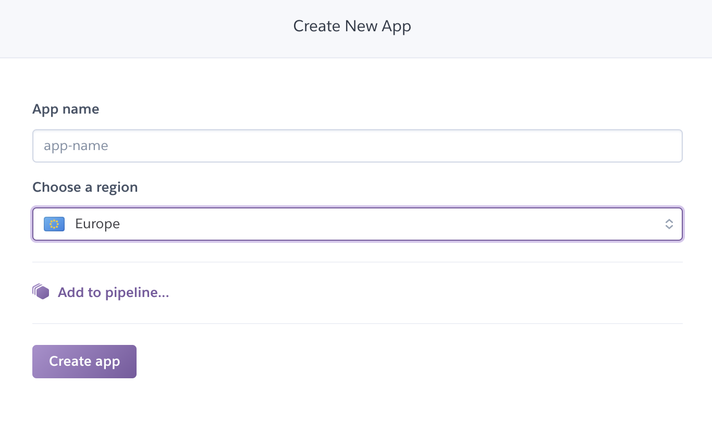
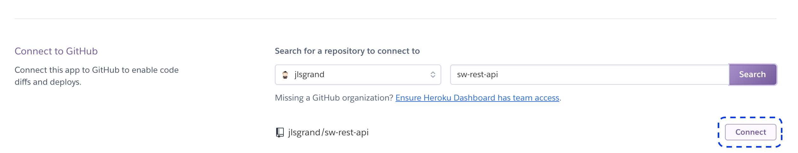
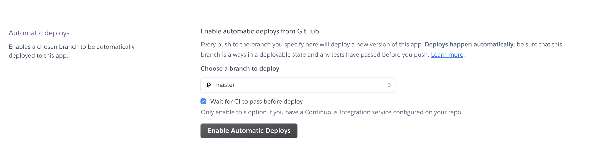

# Tester son API Star Wars

## Etape 1 : Mettre en place les tests

Avec l'exemple de l'API des villes et monuments, reprenez votre API Star Wars et ajoutez :

- Au moins 3 tests d'intégrations
- Au moins 3 tests sur vos controllers
- Au moins 3 tests sur vos services
- Au moins 1 test sur vos repositories

## Etape 2 : Mettre en place l'intégration continue

- Dans votre repository Github, repérez le petit menu `Actions` :

- Choisissez `Maven` :

- Configurez selon vos envie. Vous pouvez consulter la [documentation officielle de Github](https://help.github.com/en/actions/automating-your-workflow-with-github-actions/about-continuous-integration) pour adapter (ne faire les tests que sur la branche master, ...)

- Commitez le fichier de configuration que vous venez de créer :

Avant de passer au déploiement, vérifiez ce qu'il se passe si vous ajoutez du code qui fait échouer un test. Que se passe t-il côté Github ?

## Etape 3 : Mettre en place le déploiement continu

- Créez vous un compte sur [Heroku](https://www.heroku.com).
- Allez sur votre [Dashboard](https://dashboard.heroku.com/apps).
- Faites une nouvelle application :

- Configurez votre app :

- Choisissez de lier votre repository Github :

- Activez le déploiment automatique :

Testez à nouveau de faire un commit pour ajouter une fonctionnalié et ses tests associés. Que se passe t-il lorsque vous commitez ? Arrivez-vous à voir votre fonctionnalité directement disponible ?
